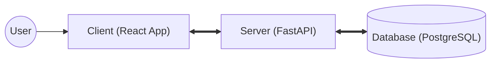
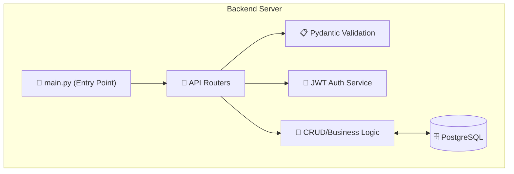
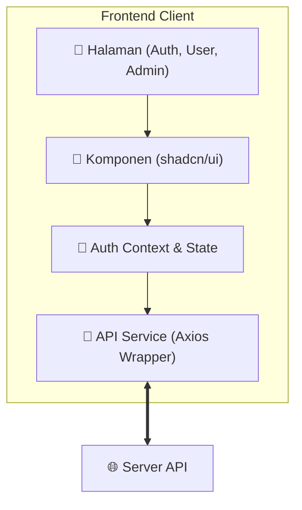
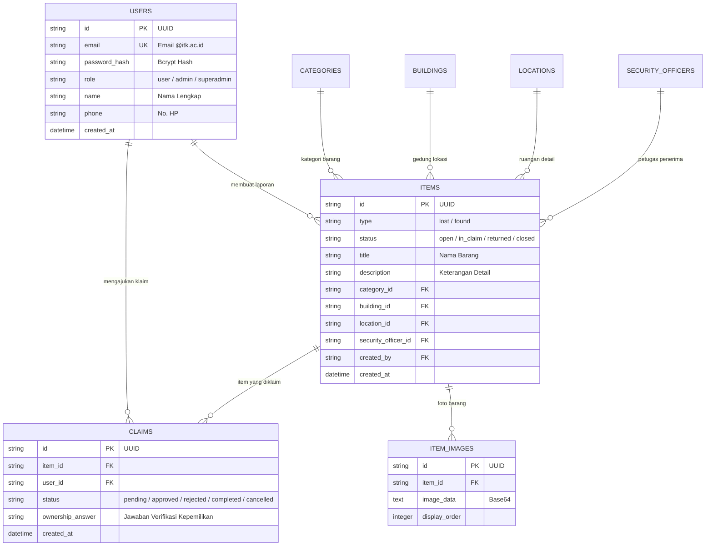

# 🔍 Temuin — Platform Lost & Found Institut Teknologi Kalimantan

> **Temuin** adalah platform manajemen barang hilang dan temuan (*Lost & Found*) berbasis web yang dirancang khusus untuk civitas akademika **Institut Teknologi Kalimantan (ITK)**. Sistem ini menjadi solusi terpusat yang menggantikan komunikasi informal (grup chat, pengumuman papan) dengan alur digital yang terstruktur, transparan, dan terdokumentasi.

---

## 📋 Daftar Isi

1. [Tentang Temuin](#-tentang-temuin)
2. [Fitur Sistem](#-fitur-sistem)
3. [Fitur Per Role](#-fitur-per-role)
4. [Arsitektur Sistem](#️-arsitektur-sistem)
5. [Desain Database (ERD)](#-desain-database-erd)
6. [Tech Stack](#-tech-stack)
7. [Dokumentasi API](#-dokumentasi-api)
8. [Panduan Menjalankan Sistem](#-panduan-menjalankan-sistem)
9. [Struktur Proyek](#-struktur-proyek)
10. [Roadmap Sprint](#-roadmap-sprint)
11. [Tim Pengembang](#-tim-pengembang)

---

## 🧩 Tentang Temuin

### Latar Belakang Masalah

Civitas kampus ITK belum memiliki sistem terpusat untuk mengelola barang hilang dan barang temuan. Informasi tersebar di grup WhatsApp, Instagram, dan komunikasi informal lainnya sehingga:

- Sulit ditelusuri siapa pelapor dan kapan barang ditemukan
- Tidak ada alur verifikasi kepemilikan yang jelas
- Tidak ada dokumentasi resmi mengenai status barang
- Rentan penyalahgunaan karena tidak ada kontrol identitas

### Solusi

Temuin menyediakan platform web terpusat dengan:

- **Autentikasi berbasis akun Google kampus** (`@itk.ac.id`) untuk memastikan identitas civitas ITK
- **Alur pelaporan barang** (lost/found) yang terstruktur dengan data lokasi dan kategori baku
- **Mekanisme klaim** dengan verifikasi kepemilikan melalui pertanyaan deskriptif
- **Panel admin** untuk moderasi dan pengambilan keputusan final
- **Notifikasi in-app** agar pengguna selalu mendapat info terkini

### Target Pengguna

| Segmen | Kebutuhan Utama |
|--------|-----------------|
| 🎓 Mahasiswa | Lapor barang hilang/temuan, cari barang, ajukan klaim |
| 👩‍🏫 Dosen & Staff | Lapor barang, cari informasi, verifikasi status |
| 🛡️ Satpam / Petugas | Menerima titipan barang temuan dari pelapor |
| ⚙️ Admin Sistem | Moderasi laporan, proses klaim, konfirmasi pengembalian |

---

## ✨ Fitur Sistem

Berikut adalah seluruh fitur MVP yang tersedia di dalam platform Temuin:

### 1. 🔐 Autentikasi & Akses
- Login via **Google OAuth** dengan validasi domain `@itk.ac.id`
- Auto-create akun internal saat pertama kali login
- Sistem **role-based access control**: `user`, `admin`, `superadmin`
- Session berbasis JWT yang aman

### 2. 📦 Pelaporan Barang (Item Reporting)
- Buat laporan **barang hilang** (`lost`) dengan deskripsi lengkap
- Buat laporan **barang temuan** (`found`) dan pilih titik penitipan ke satpam
- Upload foto barang sebagai bukti visual
- Edit laporan yang sudah dibuat
- Hapus laporan (soft delete)

### 3. 🔎 Pencarian & Penemuan (Item Discovery)
- Daftar seluruh laporan barang hilang dan temuan
- Halaman detail per item
- **Pencarian dengan keyword** di seluruh dashboard
- **Filter** berdasarkan tipe (`lost`/`found`), kategori, lokasi, status

### 4. 🤝 Klaim & Pengembalian (Claim & Return Flow)
- Ajukan klaim kepemilikan untuk barang yang ditemukan (`found`)
- Jawab pertanyaan verifikasi deskriptif untuk membuktikan kepemilikan
- Admin memproses klaim: **approve** atau **reject**
- Admin mengonfirmasi pengembalian barang (`returned`)

### 5. 🔔 Notifikasi & Riwayat
- **Notifikasi in-app** otomatis saat status klaim atau barang berubah
- **Riwayat status item** (history perubahan status barang)
- **Riwayat status klaim** (history proses klaim dari pending hingga selesai)

### 6. 🗂️ Master Data
- Kelola data referensi: **Kategori Barang**, **Gedung**, **Ruangan/Lokasi**, **Petugas Keamanan**
- Master data digunakan pada form pelaporan untuk konsistensi data

### 7. 📋 Audit Log (Admin)
- Catatan aksi penting yang dilakukan admin
- Dapat ditelusuri untuk keperluan operasional dan akuntabilitas

---

## 👥 Fitur Per Role

### 👤 Role: User (Mahasiswa / Dosen / Staff)

| # | Fitur | Keterangan |
|---|-------|------------|
| 1 | Login dengan akun Google kampus | Autentikasi via OAuth, validasi `@itk.ac.id` |
| 2 | Buat laporan barang hilang | Isi form dengan judul, deskripsi, kategori, lokasi, dan foto |
| 3 | Buat laporan barang temuan | Pilih titik titipan satpam yang bertugas |
| 4 | Lihat daftar & detail item | Browse seluruh laporan yang tercatat di sistem |
| 5 | Cari & filter barang | Gunakan pencarian keyword atau filter tipe/kategori/lokasi |
| 6 | Ajukan klaim kepemilikan | Jawab pertanyaan verifikasi untuk membuktikan barang milikmu |
| 7 | Pantau status klaim | Lihat apakah klaim `pending`, `approved`, `rejected`, atau `completed` |
| 8 | Terima notifikasi in-app | Pemberitahuan langsung di aplikasi saat ada update status |
| 9 | Lihat riwayat status | Jejak historis perubahan status item atau klaim |

---

### 🛡️ Role: Admin

| # | Fitur | Keterangan |
|---|-------|------------|
| 1 | Moderasi laporan | Edit atau hapus laporan yang tidak valid / menyalahi aturan |
| 2 | Proses klaim masuk | Tinjau jawaban verifikasi user dan bandingkan dengan deskripsi barang |
| 3 | Approve / Reject klaim | Setujui atau tolak klaim kepemilikan secara resmi |
| 4 | Konfirmasi pengembalian | Tandai barang telah dikembalikan ke pemilik (`returned`) |
| 5 | Kelola master data | Tambah, edit, hapus data Gedung, Lokasi, Kategori, dan Satpam |
| 6 | Lihat audit log | Monitoring aksi penting yang terjadi di dalam sistem |

---

### ⚡ Role: Superadmin

| # | Fitur | Keterangan |
|---|-------|------------|
| 1 | Semua fitur admin | Memiliki akses penuh ke seluruh fitur moderasi |
| 2 | Kelola role admin | Promosi atau demosi akun menjadi admin |
| 3 | Akses audit log lengkap | Menelusuri seluruh aksi penting di semua akun |

---

## 🛠️ Tech Stack Terintegrasi

Berikut adalah daftar lengkap teknologi yang digunakan dalam pengembangan sistem Temuin, mencakup frontend, backend, hingga infrastruktur.

| Kategori | Teknologi | Fungsi Utama | Penjelasan |
|:---------|:----------|:-------------|:-----------|
| **Frontend Core** | **React 19** | UI Framework | Mengelola antarmuka pengguna yang reaktif dan komponen *reusable*. |
| | **Vite 6** | Build Tool | Alat pengembangan frontend yang sangat cepat untuk *bundling* dan HMR. |
| | **React Router 7** | Routing | Mengelola navigasi antar halaman di sisi client secara dinamis. |
| **Frontend UI** | **Tailwind CSS 4** | Styling Engine | *Utility-first* CSS framework untuk desain cepat dan responsif. |
| | **shadcn/ui** | UI Component | Koleksi komponen UI siap pakai yang dibangun di atas Radix UI. |
| | **Lucide React** | Icon Pack | Set ikon vektor yang konsisten untuk mempermanis antarmuka. |
| | **Sonner** | Toast Notification | Memberikan *feedback* visual (pesan sukses/error) kepada pengguna. |
| **Backend Core** | **FastAPI** | API Framework | Framework Python berperforma tinggi untuk membangun REST API. |
| | **Python 3.12+** | Programming Language | Bahasa pemrograman utama untuk logika bisnis di sisi server. |
| | **Uvicorn** | ASGI Server | Web server yang menjalankan aplikasi FastAPI dengan mode *asynchronous*. |
| **Database/ORM** | **PostgreSQL 16** | Database Engine | Sistem manajemen database relasional untuk menyimpan seluruh data. |
| | **SQLAlchemy** | ORM | Memetakan objek Python ke tabel database untuk mempermudah kueri. |
| | **Alembic** | DB Migrations | Alat untuk melacak dan menerapkan perubahan skema database secara versi. |
| **Security & Logic** | **JWT (JSON Web Token)** | Authentication | Standar keamanan untuk pertukaran informasi identitas user antar client-server. |
| | **Pydantic v2** | Data Validation | Memastikan data yang masuk dan keluar API sesuai dengan skema yang ditentukan. |
| | **Bcrypt / Passlib** | Password Hashing | Mengamankan password user dengan algoritma *hashing* satu arah yang kuat. |
| **Infrastruktur** | **Docker** | Containerization | Membungkus aplikasi agar berjalan konsisten di lingkungan apapun. |
| | **Docker Compose** | Orchestration | Mengelola orkestrasi antar container (App, Database, Redis, dll). |
| | **PowerShell** | Automation | Scripting (`temuin.ps1`) untuk mempermudah otomasi tim pengembang. |
| **Version Control**| **Git & GitHub** | Versioning | Kolaborasi kode dan pelacakan versi. |

---

## 🏗️ Arsitektur Sistem

### 1. Overall System Architecture
Diagram tingkat tinggi yang menggambarkan interaksi antara pengguna, antarmuka web, server API, dan database.



### 2. Backend Architecture (FastAPI Modular)
Struktur internal backend yang memisahkan endpoint, validasi, keamanan, dan logika bisnis.



### 3. Frontend Architecture (React + Vite)
Struktur antarmuka pengguna yang mencakup manajemen halaman, komponen UI, dan komunikasi ke server.



---

## 📊 Desain Database (ERD)

Berikut adalah skema relasi antar tabel yang mendukung seluruh operasional platform Temuin.



---

## 📡 Dokumentasi API

| Modul | Method | Endpoint | Deskripsi |
|-------|--------|----------|-----------|
| **Auth** | `POST` | `/auth/register` | Pendaftaran akun user baru |
| | `POST` | `/auth/login` | Autentikasi & pemberian JWT |
| | `GET` | `/auth/me` | Ambil profil user yang sedang login |
| **Items** | `GET` | `/items` | Daftar semua barang (dengan filter & search) |
| | `POST` | `/items` | Buat laporan baru (lost / found) |
| | `GET` | `/items/{id}` | Detail satu item |
| | `PUT` | `/items/{id}` | Edit laporan |
| | `DELETE` | `/items/{id}` | Hapus laporan (soft delete) |
| **Claims** | `POST` | `/claims` | Ajukan klaim kepemilikan |
| | `GET` | `/claims/{id}` | Detail satu klaim |
| | `PUT` | `/claims/{id}/status` | Admin proses klaim (approve/reject/completed) |
| **Notifications** | `GET` | `/notifications` | Notifikasi in-app user |
| | `PUT` | `/notifications/{id}/read` | Tandai notifikasi sudah dibaca |
| **Master Data** | `GET` | `/master-data/categories` | Daftar kategori |
| | `GET` | `/master-data/buildings` | Daftar gedung |
| | `GET` | `/master-data/locations` | Daftar lokasi / ruangan |
| | `GET` | `/master-data/security-officers` | Daftar petugas keamanan |

> 📄 Dokumentasi interaktif tersedia di: `http://localhost:8000/docs` (Swagger UI)

---

## 🚀 Panduan Menjalankan Sistem

Pastikan Anda telah menginstal **Docker Desktop** (rekomendasi) atau **Python 3.12+** dan **Node.js** jika ingin menjalankan secara manual.

### 1. Inisialisasi Project (Clone)
```powershell
git clone https://github.com/aidilsaputrakirsan-classroom/cc-kelompok-a-extraordinary.git
cd cc-kelompok-a-extraordinary
```

### 2. Menjalankan via Docker (Paling Cepat & Stabil)
Sistem ini telah dilengkapi dengan script otomasi `temuin.ps1` untuk mempermudah manajemen container.

| Aksi | Perintah PowerShell | Keterangan |
|------|---------------------|------------|
| **Setup Env** | `copy .env.docker .env` | Salin konfigurasi environment awal |
| **Start** | `.\scripts\temuin.ps1 start` | Membangun dan menjalankan seluruh service |
| **Status** | `.\scripts\temuin.ps1 status` | Mengecek status container dan URL akses |
| **Stop** | `.\scripts\temuin.ps1 stop` | Menghentikan seluruh service yang berjalan |
| **Clean** | `docker compose down -v` | Menghentikan dan menghapus volume database |

### 3. Menjalankan Secara Manual (Development Mode)
Jika Anda ingin melakukan pengembangan aktif, jalankan service secara terpisah:

**A. Backend (FastAPI):**
```powershell
cd backend
python -m venv .venv
.\.venv\Scripts\activate
pip install -r requirements.txt
alembic upgrade head
uvicorn app.main:app --reload
```

**B. Frontend (React):**
```powershell
cd frontend
npm install
npm run dev
```

### 4. Detail Akses URL
| Layanan | URL Akses | Deskripsi |
|---------|-----------|-----------|
| **Frontend UI** | `http://localhost:5173` | Antarmuka pengguna utama |
| **Backend API** | `http://localhost:8000` | Endpoint REST API |
| **Interactive Docs** | `http://localhost:8000/docs` | Dokumentasi Swagger/OpenAPI |
| **Redocly** | `http://localhost:8000/redoc` | Dokumentasi API alternatif |

---

## 📂 Struktur Proyek

```text
cc-kelompok-a-extraordinary/
├── backend/                  # FastAPI backend
│   ├── app/
│   │   ├── auth/             # Modul autentikasi
│   │   ├── items/            # Modul item (lost & found)
│   │   ├── claims/           # Modul klaim
│   │   ├── notifications/    # Modul notifikasi
│   │   ├── master_data/      # Modul data master
│   │   ├── models/           # SQLAlchemy models
│   │   └── main.py           # Entry point FastAPI
│   ├── alembic/              # Database migrations
│   └── requirements.txt
├── frontend/                 # React + Vite frontend
│   ├── src/
│   │   ├── pages/            # Halaman utama
│   │   ├── components/       # Komponen UI reusable
│   │   ├── lib/              # Utility & config
│   │   └── main.jsx          # Entry point React
│   └── package.json
├── temuin-docs/              # Source of truth: arsitektur & sprint docs
│   ├── 00-ai/                # AI guide & role router
│   ├── 01-concept/           # Glossary & decision log
│   ├── 02-prd/               # Product Requirements Document
│   ├── 03-architecture/      # Arsitektur sistem per layer
│   ├── 04-implementation-plan/ # Definition of Done & env setup
│   ├── 05-roles/             # Role guide per anggota tim
│   └── 06-sprints/           # Sprint files & active sprint
├── docs/                     # Laporan QA sprint & panduan teknis
├── image/                    # Screenshot bukti QA per sprint
├── scripts/                  # Skrip otomasi Docker Compose
├── docker-compose.yml
├── .env.docker
└── AGENTS.md                 # Entry point AI coding agent
```

---

## 🗺️ Roadmap Sprint & Bukti Pengerjaan

Berikut adalah progres pengerjaan tim per sprint beserta link cepat menuju laporan QA sebagai bukti pengerjaan.

| Sprint | Fokus Utama | Status | Bukti Laporan |
|:-------|:------------|:------:|:--------------|
| **Sprint 1** | Setup project, fondasi database, scaffold frontend | ✅ Done | [📄 Lihat Laporan](docs/sprint-01-qa-report.md) |
| **Sprint 2** | Auth (Google Login), core item flow (CRUD laporan) | ✅ Done | [📄 Lihat Laporan](docs/sprint-02-qa-report.md) |
| **Sprint 3** | Search & filter, klaim, notifikasi, master data | ✅ Done | [📄 Lihat Laporan](docs/sprint-03-qa-report.md) |
| **Sprint 4** | Dockerization & kesiapan demo UTS | ✅ Done | [📄 Lihat Laporan](docs/sprint-04-qa-report.md) |
| **Sprint 5** | CI/CD GitHub Actions & test automation backend | 🔄 Next | - |
| **Sprint 6** | Microservices split (auth-service & item-service) | 🔄 Next | - |
| **Sprint 7** | Nginx gateway, monitoring, audit log lanjut | 🔄 Next | - |
| **Sprint 8** | Security hardening & final polish | 🔄 Next | - |

**Status Fase UTS:** ✅ **Sprint 1–4 Stabil & Fully Dockerized**

---

## 👥 Tim Pengembang (Extraordinary)

Kami adalah kelompok mahasiswa dari program studi **Sistem Informasi**, Institut Teknologi Kalimantan yang berdedikasi membangun solusi digital untuk kampus.

| Profile | Nama | Role | Fokus Area |
|:-------:|------|------|------------|
|  | **Disne Jayaprana**<br/>[@disnejy](https://github.com/disnejy) | **Lead Backend** | Arsitektur API, Database Design, Service Logic, & JWT Security |
|  | **Nicholas Meinhard**<br/>[@nicholasmnrng](https://github.com/nicholasmnrng) | **Lead Frontend** | UI/UX Implementation, React Hooks, shadcn/ui, & API Integration |
|  | **Pangeran Silaen**<br/>[@PangeranSilaen](https://github.com/PangeranSilaen) | **Lead DevOps** | Dockerization, CI/CD Pipelines, Environment Setup, & Automation |
|  | **Rani Ayu Dewi**<br/>[@raniayudewi](https://github.com/raniayudewi) | **Lead QA & Docs** | Blackbox Testing, Sprint Reporting, Documentation, & Knowledge Management |

---

## 📚 Referensi Dokumentasi

- [`temuin-docs/`](./temuin-docs/) — Source of truth: arsitektur, PRD, sprint, dan role guide
- [`docs/`](./docs/) — Laporan QA sprint dan panduan teknis setup
- [`docs/docker-guide.md`](./docs/docker-guide.md) — Panduan lengkap menjalankan Docker
- [`AGENTS.md`](./AGENTS.md) — Entry point untuk AI coding agent

---

<div align="center">
  <sub>Built with ❤️ by Kelompok A Extraordinary — Institut Teknologi Kalimantan</sub>
</div>
