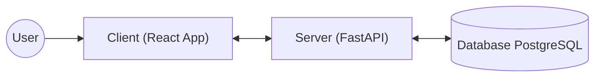
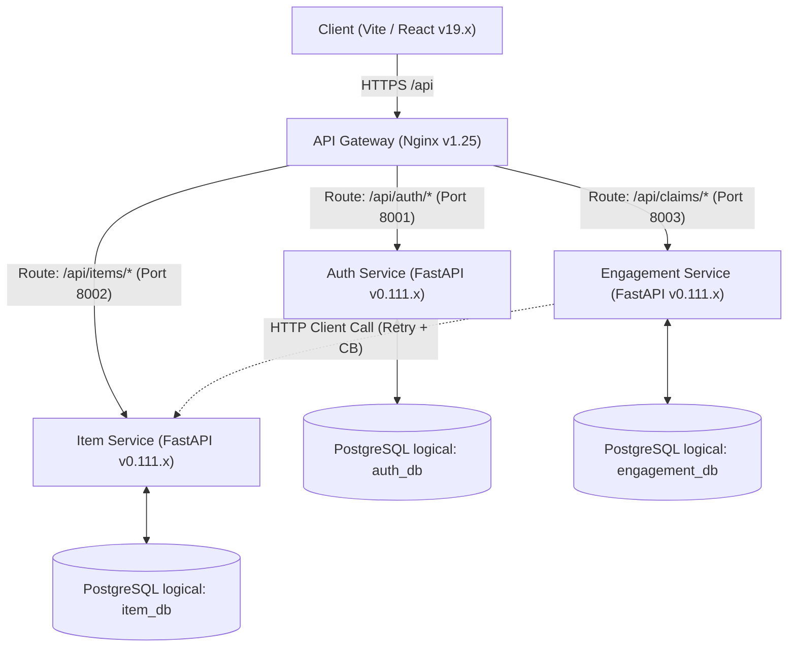
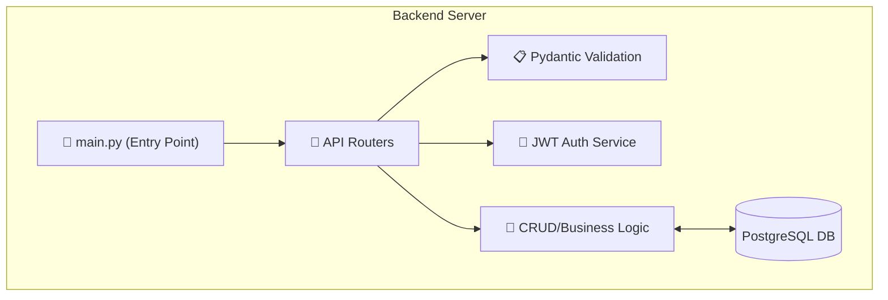
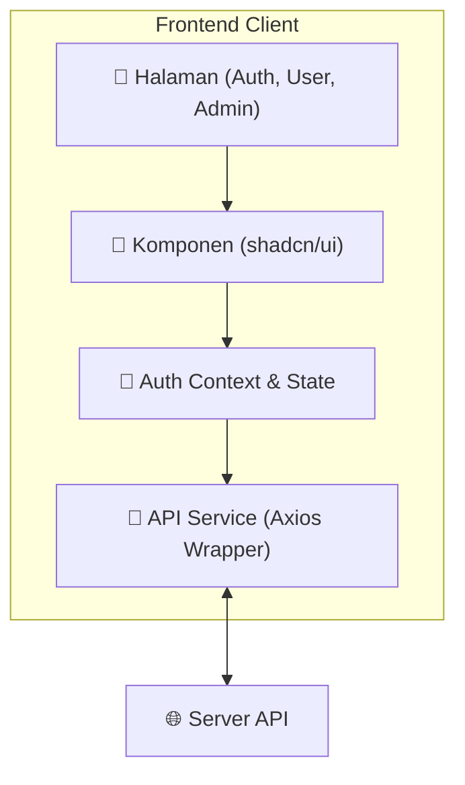
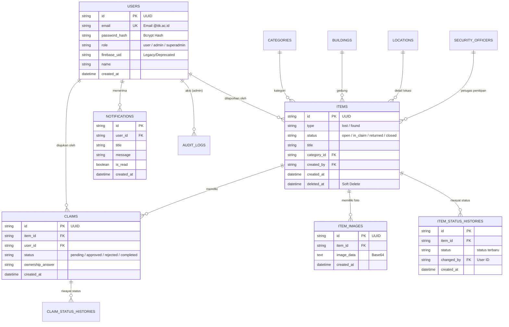
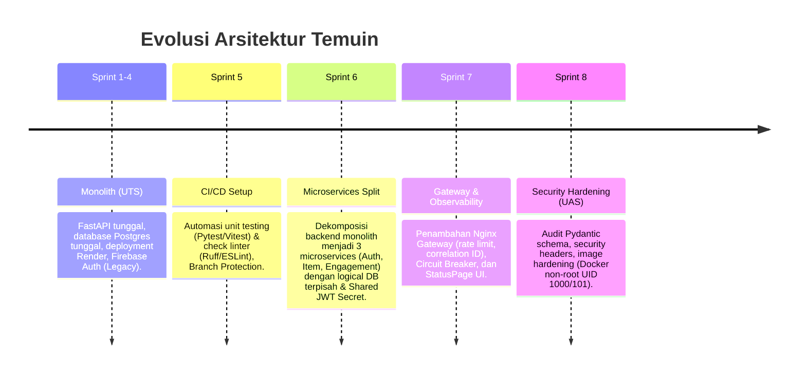

# 🔍 Temuin — Platform Lost & Found Institut Teknologi Kalimantan

[](https://github.com/aidilsaputrakirsan-classroom/cc-kelompok-a-extraordinary/actions/workflows/ci.yml)

> **Temuin** adalah platform manajemen barang hilang dan temuan (*Lost & Found*) berbasis web yang dirancang khusus untuk civitas akademika **Institut Teknologi Kalimantan (ITK)**. Sistem ini menjadi solusi terpusat yang menggantikan komunikasi informal (grup chat, pengumuman papan) dengan alur digital yang terstruktur, transparan, dan terdokumentasi.

> [!IMPORTANT]
> **🚀 Akses Cepat Kesiapan Demo UAS & Dokumentasi:**
> - **Live URL:** [https://temuin.pangeransilaen.net](https://temuin.pangeransilaen.net)
> - **Kontrak API:** [api-contract.md](./docs/api-contract.md)
> - **Panduan Demo (Checklist):** [final-checklist.md](./docs/final-checklist.md)
> - **Laporan QA Sprint 08:** [sprint-08-qa-report.md](./docs/sprint-08-qa-report.md)

---

## 📋 Daftar Isi

1. [Tentang Temuin](#-tentang-temuin)
2. [Fitur Sistem](#-fitur-sistem)
3. [Fitur Per Role](#-fitur-per-role)
4. [Arsitektur Sistem](#️-arsitektur-sistem)
5. [Desain Database (ERD)](#-desain-database-erd)
6. [Tech Stack](#-tech-stack)
7. [Dokumentasi API](#-dokumentasi-api)
8. [Panduan Menjalankan Sistem](#-panduan-menjalankan-sistem)
9. [Panduan Deployment](#-panduan-deployment)
10. [Project Journey (Evolusi Monolith ke Microservices)](#-project-journey-monolith-to-microservices)
11. [Struktur Proyek](#-struktur-proyek)
12. [Roadmap Sprint](#-roadmap-sprint)
13. [Tim Pengembang](#-tim-pengembang)
14. [Referensi Dokumentasi](#-referensi-dokumentasi)

---

## 🧩 Tentang Temuin

### Latar Belakang Masalah

Civitas kampus ITK belum memiliki sistem terpusat untuk mengelola barang hilang dan barang temuan. Informasi tersebar di grup WhatsApp, Instagram, dan komunikasi informal lainnya sehingga:

- Sulit ditelusuri siapa pelapor dan kapan barang ditemukan
- Tidak ada alur verifikasi kepemilikan yang jelas
- Tidak ada dokumentasi resmi mengenai status barang
- Rentan penyalahgunaan karena tidak ada kontrol identitas

### Solusi

Temuin menyediakan platform web terpusat dengan:

- **Autentikasi berbasis email kampus** (`@itk.ac.id` / `@student.itk.ac.id`) untuk memastikan identitas civitas ITK
- **Alur pelaporan barang** (lost/found) yang terstruktur dengan data lokasi dan kategori baku
- **Mekanisme klaim** dengan verifikasi kepemilikan melalui pertanyaan deskriptif
- **Panel admin** untuk moderasi dan pengambilan keputusan final
- **Notifikasi in-app** agar pengguna selalu mendapat info terkini

### Target Pengguna

| Segmen | Kebutuhan Utama |
|--------|-----------------|
| 🎓 Mahasiswa | Lapor barang hilang/temuan, cari barang, ajukan klaim |
| 👩‍🏫 Dosen & Staff | Lapor barang, cari informasi, verifikasi status |
| 🛡️ Satpam / Petugas | Menerima titipan barang temuan dari pelapor |
| ⚙️ Admin Sistem | Moderasi laporan, proses klaim, konfirmasi pengembalian |

---

## ✨ Fitur Sistem

Berikut adalah seluruh fitur MVP yang tersedia di dalam platform Temuin:

### 1. 🔐 Autentikasi & Akses
- Login menggunakan **Email & Password** dengan validasi domain `@itk.ac.id`
- Registrasi mandiri akun internal ITK
- Sistem **role-based access control**: `user`, `admin`, `superadmin`
- Pengamanan session berbasis **internal JWT** dan password hashing (Bcrypt)

### 2. 📦 Pelaporan Barang (Item Reporting)
- Buat laporan **barang hilang** (`lost`) dengan deskripsi lengkap
- Buat laporan **barang temuan** (`found`) dan pilih titik penitipan ke satpam
- Upload foto barang sebagai bukti visual
- Edit laporan yang sudah dibuat
- Hapus laporan (soft delete)

### 3. 🔎 Pencarian & Penemuan (Item Discovery)
- Daftar seluruh laporan barang hilang dan temuan
- Halaman detail per item
- **Pencarian dengan keyword** di seluruh dashboard
- **Filter** berdasarkan tipe (`lost`/`found`), kategori, lokasi, status

### 4. 🤝 Klaim & Pengembalian (Claim & Return Flow)
- Ajukan klaim kepemilikan untuk barang yang ditemukan (`found`)
- Jawab pertanyaan verifikasi deskriptif untuk membuktikan kepemilikan
- Admin memproses klaim: **approve** atau **reject**
- Admin mengonfirmasi pengembalian barang (`returned`)

### 5. 🔔 Notifikasi & Riwayat
- **Notifikasi in-app** otomatis saat status klaim atau barang berubah
- **Riwayat status item** (history perubahan status barang)
- **Riwayat status klaim** (history proses klaim dari pending hingga selesai)

### 6. 🗂️ Master Data
- Kelola data referensi: **Kategori Barang**, **Gedung**, **Ruangan/Lokasi**, **Petugas Keamanan**
- Master data digunakan pada form pelaporan untuk konsistensi data

### 7. 📋 Audit Log (Admin)
- Catatan aksi penting yang dilakukan admin
- Dapat ditelusuri untuk keperluan operasional dan akuntabilitas

---

## 👥 Fitur Per Role

### 👤 Role: User (Mahasiswa / Dosen / Staff)

| # | Fitur | Keterangan |
|---|-------|------------|
| 1 | Registrasi & Login akun ITK | Gunakan email @itk.ac.id dan password |
| 2 | Buat laporan barang hilang | Isi form dengan judul, deskripsi, kategori, lokasi, dan foto |
| 3 | Buat laporan barang temuan | Pilih titik titipan satpam yang bertugas |
| 4 | Lihat daftar & detail item | Browse seluruh laporan yang tercatat di sistem |
| 5 | Cari & filter barang | Gunakan pencarian keyword atau filter tipe/kategori/lokasi |
| 6 | Ajukan klaim kepemilikan | Jawab pertanyaan verifikasi untuk membuktikan barang milikmu |
| 7 | Pantau status klaim | Lihat apakah klaim `pending`, `approved`, `rejected`, atau `completed` |
| 8 | Terima notifikasi in-app | Pemberitahuan langsung di aplikasi saat ada update status |
| 9 | Lihat riwayat status | Jejak historis perubahan status item atau klaim |

---

### 🛡️ Role: Admin

| # | Fitur | Keterangan |
|---|-------|------------|
| 1 | Moderasi laporan | Edit atau hapus laporan yang tidak valid / menyalahi aturan |
| 2 | Proses klaim masuk | Tinjau jawaban verifikasi user dan bandingkan dengan deskripsi barang |
| 3 | Approve / Reject klaim | Setujui atau tolak klaim kepemilikan secara resmi |
| 4 | Konfirmasi pengembalian | Tandai barang telah dikembalikan ke pemilik (`returned`) |
| 5 | Kelola master data | Tambah, edit, hapus data Gedung, Lokasi, Kategori, dan Satpam |
| 6 | Lihat audit log | Monitoring aksi penting yang terjadi di dalam sistem |

---

### ⚡ Role: Superadmin

| # | Fitur | Keterangan |
|---|-------|------------|
| 1 | Semua fitur admin | Memiliki akses penuh ke seluruh fitur moderasi |
| 2 | Kelola role admin | Promosi atau demosi akun menjadi admin |
| 3 | Akses audit log lengkap | Menelusuri seluruh aksi penting di semua akun |

---

## 🛠️ Tech Stack Terintegrasi

Berikut adalah daftar lengkap teknologi yang digunakan dalam pengembangan sistem Temuin, mencakup frontend, backend, hingga infrastruktur.

| Kategori | Teknologi | Fungsi Utama | Penjelasan |
|:---------|:----------|:-------------|:-----------|
| **Frontend Core** | **React v19.x** | UI Framework | Mengelola antarmuka pengguna yang reaktif dan komponen *reusable*. |
| | **Vite v6.x** | Build Tool | Alat pengembangan frontend yang sangat cepat untuk *bundling* dan HMR. |
| | **React Router v7.x** | Routing | Mengelola navigasi antar halaman di sisi client secara dinamis. |
| **Frontend UI** | **Tailwind CSS v4.x** | Styling Engine | *Utility-first* CSS framework untuk desain cepat dan responsif. |
| | **shadcn/ui** | UI Component | Koleksi komponen UI siap pakai yang dibangun di atas Radix UI. |
| | **Lucide React** | Icon Pack | Set ikon vektor yang konsisten untuk mempermanis antarmuka. |
| | **Sonner** | Toast Notification | Memberikan *feedback* visual (pesan sukses/error) kepada pengguna. |
| **Backend Core** | **FastAPI v0.111.x** | API Framework | Framework Python berperforma tinggi untuk membangun REST API. |
| | **Python v3.12+** | Programming Language | Bahasa pemrograman utama untuk logika bisnis di sisi server. |
| | **Uvicorn v0.30.x** | ASGI Server | Web server yang menjalankan aplikasi FastAPI dengan mode *asynchronous*. |
| **Database/ORM** | **PostgreSQL v16.x** | Database Engine | Sistem manajemen database relasional untuk menyimpan seluruh data. |
| | **SQLAlchemy v2.0.x** | ORM | Memetakan objek Python ke tabel database untuk mempermudah kueri. |
| | **Alembic v1.13.x** | DB Migrations | Alat untuk melacak dan menerapkan perubahan skema database secara versi. |
| **Security & Logic** | **JWT (JSON Web Token)** | Authentication | Standar keamanan untuk pertukaran informasi identitas user antar client-server. |
| | **Pydantic v2.x** | Data Validation | Memastikan data yang masuk dan keluar API sesuai dengan skema yang ditentukan. |
| | **Bcrypt / Passlib** | Password Hashing | Mengamankan password user dengan algoritma *hashing* satu arah yang kuat. |
| **Infrastruktur** | **Docker v26.x** | Containerization | Membungkus aplikasi agar berjalan konsisten di lingkungan apapun. |
| | **Docker Compose v2.x** | Orchestration | Mengelola orkestrasi antar container (App, Database, dll). |
| | **Nginx v1.25 (Alpine)** | API Gateway & Web Server | Bertindak sebagai pintu masuk terpadu, penanganan rate limiting, dan tracking Correlation ID (DEC-023). |
| | **PowerShell** | Automation | Scripting (`temuin.ps1`) untuk mempermudah otomasi tim pengembang. |
| **Version Control**| **Git & GitHub** | Versioning | Kolaborasi kode dan pelacakan versi. |

---

## 🏗️ Arsitektur Sistem

### 1. Overall System Architecture
Diagram tingkat tinggi yang menggambarkan interaksi antara pengguna, antarmuka web, server API, dan database.



### 1.1 Microservices Architecture (Current Stage)
Arsitektur setelah dekomposisi sistem (Sprint 6+) menjadi 3 layanan mandiri (hybrid microservices) di belakang API Gateway Nginx.



### 2. Backend Architecture (FastAPI Modular)
Struktur internal backend yang memisahkan endpoint, validasi, keamanan, dan logika bisnis.



### 3. Frontend Architecture (React + Vite)
Struktur antarmuka pengguna yang mencakup manajemen halaman, komponen UI, dan komunikasi ke server.



---

### Detail Atribut Database (Data Dictionary)

#### 1. Tabel: `users`
Menyimpan informasi identitas pengguna dan kredensial login.
| Atribut | Tipe Data | Constraint | Keterangan |
|---------|-----------|------------|------------|
| `id` | UUID | PK | Identifier unik user. |
| `email` | String | UK, Not Null | Email institusi (@itk.ac.id). |
| `password_hash` | String | Not Null | Password yang sudah di-hash (Bcrypt). |
| `role` | String | Not Null | Peran user (`user`, `admin`, `superadmin`). |
| `name` | String | Not Null | Nama lengkap pengguna. |
| `phone` | String | Nullable | Nomor WhatsApp untuk koordinasi klaim. |
| `firebase_uid` | String | Nullable | (Legacy) ID dari Firebase Auth terdahulu. |
| `created_at` | DateTime | Default: Now | Waktu pendaftaran akun. |

#### 2. Tabel: `items`
Menyimpan data laporan barang hilang (`lost`) dan barang temuan (`found`).
| Atribut | Tipe Data | Constraint | Keterangan |
|---------|-----------|------------|------------|
| `id` | UUID | PK | Identifier unik item. |
| `type` | String | Not Null | Tipe laporan (`lost` atau `found`). |
| `status` | String | Not Null | Status: `open`, `in_claim`, `returned`, `closed`. |
| `title` | String | Not Null | Judul singkat barang. |
| `description` | Text | Not Null | Deskripsi detail ciri-ciri barang. |
| `category_id` | UUID | FK | Relasi ke tabel `categories`. |
| `building_id` | UUID | FK | Relasi ke tabel `buildings`. |
| `location_id` | UUID | FK | Relasi ke tabel `locations`. |
| `created_by` | UUID | FK | Relasi ke `users.id` (si pelapor). |
| `created_at` | DateTime | Default: Now | Waktu laporan dibuat. |
| `deleted_at` | DateTime | Nullable | Timestamp untuk fitur Soft Delete. |

#### 3. Tabel: `claims`
Menyimpan data pengajuan kepemilikan barang oleh pengguna.
| Atribut | Tipe Data | Constraint | Keterangan |
|---------|-----------|------------|------------|
| `id` | UUID | PK | Identifier unik klaim. |
| `item_id` | UUID | FK | Barang temuan yang diklaim. |
| `user_id` | UUID | FK | User yang mengajukan klaim. |
| `status` | String | Not Null | `pending`, `approved`, `rejected`, `completed`. |
| `ownership_answer` | Text | Not Null | Jawaban user untuk membuktikan kepemilikan. |
| `created_at` | DateTime | Default: Now | Waktu pengajuan klaim. |

#### 4. Tabel: `item_images`
Menyimpan data visual barang (maks 2MB per gambar).
| Atribut | Tipe Data | Constraint | Keterangan |
|---------|-----------|------------|------------|
| `id` | UUID | PK | Identifier unik gambar. |
| `item_id` | UUID | FK | Relasi ke `items.id`. |
| `image_data` | Text | Not Null | Data gambar dalam format Base64. |
| `display_order` | Integer | Default: 0 | Urutan tampilan gambar di galeri. |
| `created_at` | DateTime | Default: Now | Waktu upload gambar. |

#### 5. Tabel: `notifications`
Sistem notifikasi real-time untuk memberitahukan perubahan status klaim/barang.
| Atribut | Tipe Data | Constraint | Keterangan |
|---------|-----------|------------|------------|
| `id` | UUID | PK | Identifier unik notifikasi. |
| `user_id` | UUID | FK | Penerima notifikasi (`users.id`). |
| `title` | String | Not Null | Judul notifikasi. |
| `message` | Text | Not Null | Isi pesan notifikasi. |
| `is_read` | Boolean | Default: False| Status apakah sudah dibaca user. |
| `created_at` | DateTime | Default: Now | Waktu pengiriman notifikasi. |

#### 6. Tabel: `item_status_histories` / `claim_status_histories`
Audit trail untuk melacak setiap perpindahan status data.
| Atribut | Tipe Data | Constraint | Keterangan |
|---------|-----------|------------|------------|
| `id` | UUID | PK | Identifier unik riwayat. |
| `item_id` / `claim_id`| UUID | FK | Relasi ke entitas induk terkait. |
| `status` | String | Not Null | Status baru setelah perubahan dilakukan. |
| `changed_by` | UUID | FK | Pelaku perubahan status (`users.id`). |
| `created_at` | DateTime | Default: Now | Waktu kejadian perubahan. |

#### 7. Tabel: `audit_logs`
Mencatat aksi administratif krusial yang dilakukan oleh Admin/Superadmin.
| Atribut | Tipe Data | Constraint | Keterangan |
|---------|-----------|------------|------------|
| `id` | UUID | PK | Identifier unik log. |
| `user_id` | UUID | FK | Aktor yang melakukan aksi (`users.id`). |
| `action` | String | Not Null | Jenis aksi (misal: "DELETE_USER", "RESET_DB"). |
| `target_table`| String | Not Null | Tabel yang terdampak aksi tersebut. |
| `details` | JSON | Nullable | Detail teknis mengenai parameter aksi. |
| `created_at` | DateTime | Default: Now | Waktu eksekusi aksi. |

#### 8. Tabel Master Data (Support Tables)
Tabel referensi yang digunakan untuk drop-down menu pada form pelaporan.
*   **`categories`**: Daftar kategori barang (Elektronik, Dokumen, dll).
*   **`buildings`**: Daftar gedung di lingkungan ITK.
*   **`locations`**: Detail titik lokasi (Lobby, Lab, Kantin, dll).
*   **`security_officers`**: Daftar satpam yang berjaga di titik penitipan `found` items.
*(Setiap tabel master memiliki atribut minimal: `id` (PK) dan `name` (String, Not Null)).*

---



---

## 📡 Dokumentasi API

| Modul | Method | Endpoint | Deskripsi |
|-------|--------|----------|-----------|
| **Auth** | `POST` | `/auth/register` | Pendaftaran akun user baru |
| | `POST` | `/auth/login` | Autentikasi untuk mendapatkan JWT |
| | `GET` | `/auth/me` | Ambil profil user aktif |
| | `PUT` | `/auth/me` | Update profil (Nama/No HP) |
| **Items** | `GET` | `/items` | Daftar semua barang (filter & search) |
| | `POST` | `/items` | Buat laporan baru (lost / found) |
| | `GET` | `/items/me` | Daftar barang milik user aktif |
| | `GET` | `/items/{id}` | Detail informasi satu item |
| | `PUT` | `/items/{id}` | Edit laporan barang |
| | `DELETE` | `/items/{id}` | Hapus laporan (soft delete) |
| **Claims** | `POST` | `/claims` | Ajukan klaim kepemilikan |
| | `GET` | `/claims/me` | Riwayat klaim user aktif |
| | `GET` | `/claims/{id}` | Detail satu klaim |
| | `GET` | `/claims` | List klaim (Filter by item/Admin all) |
| | `PUT` | `/claims/{id}/status` | Admin proses klaim (approve/reject/completed) |
| **Notifications** | `GET` | `/notifications/me` | Notifikasi in-app user aktif |
| | `PUT` | `/notifications/read-all` | Tandai semua notifikasi terbaca |
| | `PUT` | `/notifications/{id}/read` | Tandai satu notifikasi terbaca |
| **Master Data** | `GET` | `/master-data/{type}` | Ambil data (categories/buildings/etc) |
| | `POST` | `/master-data/{type}` | Admin: Tambah data master baru |
| | `PUT` | `/master-data/{type}/{id}` | Admin: Edit data master |
| | `DELETE` | `/master-data/{type}/{id}` | Admin: Hapus data master |

> 📄 **Dokumentasi Kontrak API Resmi (Microservices)**: [**api-contract.md**](./docs/api-contract.md)
> 📄 Dokumentasi interaktif tersedia di: `http://localhost:8000/docs` (Swagger UI)

---

## 🚀 Panduan Menjalankan Sistem

Pastikan Anda telah menginstal **Docker Desktop** (rekomendasi) atau **Python 3.12+** dan **Node.js** jika ingin menjalankan secara manual.

### 1. Inisialisasi Project (Clone)
```powershell
git clone https://github.com/aidilsaputrakirsan-classroom/cc-kelompok-a-extraordinary.git
cd cc-kelompok-a-extraordinary
```

### 2. Menjalankan via Docker (Rekomendasi)
Sistem ini menggunakan Docker untuk menyatukan Frontend, Backend, dan Database agar dapat berjalan secara konsisten di semua perangkat.

#### 🐳 Docker Compose Commands (Standard)
Jika Anda ingin menggunakan perintah Docker standar, berikut adalah tabel referensinya:
| Command | Keterangan |
|---------|------------|
| `docker compose up` | Menjalankan semua service di terminal (log terlihat). |
| `docker compose up -d` | Menjalankan service di background (*detached mode*). |
| `docker compose down` | Menghentikan dan menghapus seluruh container. |
| `docker compose logs -f` | Melihat log aktivitas dari seluruh service. |
| `docker compose ps` | Menampilkan status dan port seluruh container. |
| `docker compose up -d --build` | Membangun ulang image lalu menjalankan ulang service. |

#### 🚀 Temuin Orchestration Script (Automation)
Untuk mempermudah tim pengembang, kami telah menyediakan script **`temuin.ps1`** (Windows) dan **`temuin.sh`** (Linux/Mac). Script ini adalah *wrapper* cerdas yang membungkus perintah Docker di atas dengan fitur tambahan.

| Perintah | Fungsi Utama | Kelebihan dibanding Docker Standar |
|----------|--------------|------------------------------------|
| `.\scripts\temuin.ps1 start` | **Start System** | Otomatis cek `.env`, nyalakan Docker, dan tampilkan link akses URL. |
| `.\scripts\temuin.ps1 status` | **Check Health** | Menampilkan status container beserta URL Frontend/Backend/Docs. |
| `.\scripts\temuin.ps1 seed` | **Isi Data** | Menjalankan script pengisian data contoh ke dalam database. |
| `.\scripts\temuin.ps1 reset` | **Factory Reset** | Menghapus database, *pull* image terbaru, dan mulai dari nol. |
| `.\scripts\temuin.ps1 stop` | **Stop System** | Mematikan seluruh service dengan aman. |

> 💡 **Rekomendasi:** Selalu gunakan `.\scripts\temuin.ps1 start` sebagai pengganti `docker compose up` untuk menghindari kesalahan konfigurasi `.env`.

### 3. Menjalankan Secara Manual (Development Mode)
Jika Anda ingin melakukan pengembangan aktif, jalankan service secara terpisah:

**A. Backend (FastAPI):**
```powershell
cd backend
python -m venv .venv
.\.venv\Scripts\activate
pip install -r requirements.txt
alembic upgrade head
uvicorn app.main:app --reload
```

**B. Frontend (React):**
```powershell
cd frontend
npm install
npm run dev
```

### 4. Detail Akses URL
| Layanan | URL Akses | Deskripsi |
|---------|-----------|-----------|
| **Frontend UI** | `http://localhost:5173` | Antarmuka pengguna utama |
| **Backend API** | `http://localhost:8000` | Endpoint REST API |
| **Interactive Docs** | `http://localhost:8000/docs` | Dokumentasi Swagger/OpenAPI |
| **Redocly** | `http://localhost:8000/redoc` | Dokumentasi API alternatif |

---

## 🌐 Panduan Deployment

Platform Temuin berjalan di lingkungan produksi menggunakan **Tencent Cloud VPS** dengan alamat domain utama **`https://temuin.pangeransilaen.net`**.

### 1. Arsitektur Deployment (2-Layer Nginx)
Untuk menjaga keamanan dan isolasi port kontainer, deployment Temuin menerapkan pola Nginx ganda:
- **Nginx Host (Layer 1)**: Berjalan langsung di VPS, bertindak sebagai *SSL Termination* (menggunakan Certbot Let's Encrypt) dan me-forward seluruh lalu lintas HTTPS (port 443) ke kontainer Gateway internal (port 8080).
- **Nginx Gateway (Layer 2)**: Berjalan di dalam Docker (`temuin-gateway`), bertindak sebagai reverse proxy terpadu yang mendistribusikan request ke masing-masing service (Auth, Item, Engagement) dan melayani aset statis Frontend.

### 2. Cara Menjalankan Deployment di Cloud (VPS)
Deployment ke server produksi dikelola secara otomatis menggunakan pipeline **CI/CD Continuous Deployment** pada saat push ke branch `master`. Jika ingin melakukan deployment ulang secara manual di server VPS:

1. Masuk ke server VPS via SSH:
   ```bash
   ssh username@vps-ip-address
   ```
2. Pindah ke direktori deployment:
   ```bash
   cd /opt/temuin/
   ```
3. Tarik versi kode terbaru dari repositori GitHub:
   ```bash
   git pull origin master
   ```
4. Bangun ulang image dan jalankan container produksi:
   ```bash
   docker compose -f docker-compose.prod.yml up -d --build
   ```
5. Bersihkan image atau container usang untuk menjaga kapasitas memori VPS:
   ```bash
   docker system prune -f
   ```

---

## 📈 Project Journey (Monolith to Microservices)

Proyek Temuin telah mengalami evolusi arsitektur yang signifikan, dari sebuah server Monolith sederhana hingga bertransformasi menjadi sistem terdistribusi (Microservices) yang tangguh, aman, dan siap produksi untuk UAS. Berikut adalah kronologi dan rincian teknis perjalanan tersebut:



### 1. Fase Monolith (Sprint 1–4 - Target UTS)
Pada awal pengembangan, Temuin dirancang dengan arsitektur **Monolith** menggunakan FastAPI sebagai server backend tunggal. 
- **Alasan**: Mempercepat perakitan MVP (Minimum Viable Product), memudahkan koordinasi tim dalam mengintegrasikan UI React dengan database PostgreSQL tunggal, dan memfokuskan pengerjaan pada core business logic.
- **Tantangan & Evaluasi**: 
  - Awalnya autentikasi menggunakan *Firebase Auth*. Namun, tim menghadapi isu kegagalan jaringan (*intermittent failure*) pada web seluler, isu pembatasan API key dari Google Console, serta kompleksitas verifikasi token Firebase secara remote.
  - **Keputusan ([DEC-002](./temuin-docs/01-concept/decision-log.md#L12))**: Menghapus Firebase Auth dan membangun sistem autentikasi mandiri berbasis password hashing (Bcrypt) dan JWT Token lokal dengan aturan ketat: hanya domain email kampus `@itk.ac.id` dan `@student.itk.ac.id` yang diizinkan mendaftar untuk menjaga integritas komunitas kampus.

### 2. Fase Dekomposisi Microservices (Sprint 6)
Untuk memenuhi standar skalabilitas Modul 11-12 dan menghindari *single point of failure* (satu modul error meruntuhkan seluruh server), kami memecah monolith backend menjadi **3 Hybrid Microservices**:
- **`auth-service` (Port 8001)**: Bertanggung jawab penuh atas manajemen identitas, registrasi user, login, dan pembuatan JWT token.
- **`item-service` (Port 8002)**: Mengelola siklus hidup pelaporan barang hilang (`lost`) dan temuan (`found`) serta memelihara data master gedung, kategori, lokasi, dan petugas keamanan.
- **`engagement-service` (Port 8003)**: Menangani transaksi klaim barang temuan oleh pengguna, riwayat status klaim, logs notifikasi, dan pencatatan audit trail admin.
- **Isolasi Database (Database-per-Service - [DEC-019](./temuin-docs/01-concept/decision-log.md#L99))**: Demi menghemat memori pada Tencent VPS produksi yang hanya memiliki RAM 1.9 GB, kami tidak menyewa 3 instance DB PostgreSQL terpisah. Sebagai gantinya, kami menggunakan satu instans PostgreSQL bersama yang dibagi secara logis menjadi 3 skema database independen: `auth_db`, `item_db`, dan `engagement_db`. Masing-masing service hanya diizinkan mengakses database logikalnya sendiri.
- **Shared JWT Verification ([DEC-017](./temuin-docs/01-concept/decision-log.md#L83))**: Untuk meminimalkan latensi jaringan antar-service, validasi token JWT pada `item-service` dan `engagement-service` dilakukan secara lokal menggunakan *Shared JWT Secret* yang disuntikkan via env var, sehingga service tidak perlu melakukan pemanggilan REST ke `auth-service` untuk setiap request.

### 3. Fase Gateway, Observability & Reliability (Sprint 7)
Setelah dekomposisi, arsitektur terdistribusi ini membutuhkan orkestrasi, pengawasan, dan keandalan komunikasi:
- **API Gateway (Nginx - [DEC-023](./temuin-docs/01-concept/decision-log.md#L132))**: Menyediakan gerbang tunggal (port 8080) untuk menyembunyikan port kontainer internal dari publik. Nginx Gateway dikonfigurasi dengan limitasi laju request (*Rate Limiting*): maks 5 req/s (burst 10) untuk rute login/register guna mencegah serangan brute-force, dan 30 req/s (burst 50) untuk endpoint umum.
- **Request Tracing via Correlation ID ([DEC-022](./temuin-docs/01-concept/decision-log.md#L123))**: Gateway secara otomatis menyuntikkan header `X-Correlation-ID` berupa 12 karakter alfanumerik unik untuk setiap request baru. ID ini diteruskan ke header komunikasi antar-service dan ditulis ke dalam file log terstruktur (format JSON) untuk mempermudah pelacakan error.
- **Keandalan Komunikasi (Resilience - [DEC-021](./temuin-docs/01-concept/decision-log.md#L115))**: Jalur inter-service utama (`engagement-service` $\rightarrow$ `item-service`) diperkuat menggunakan **Retry Pattern** (3 kali percobaan ulang dengan exponential backoff 0.5s, 1s, 2s) dan **Circuit Breaker** in-memory (status CLOSED berpindah ke OPEN jika terjadi 5 kegagalan dalam 30 detik). Hal ini mencegah sistem macet total dan memungkinkan *Graceful Degradation* (misal: halaman daftar klaim tetap bisa merespons data klaim dasar meskipun server item sedang offline).
- **Monitoring (StatusPage)**: Menyediakan endpoint `/api/status` aggregator kesehatan dan menampilkan dasbor indikator dinamis (UP/DOWN) di route `/status` frontend dengan pembaruan data otomatis setiap 30 detik.

### 4. Fase Security Hardening & Final Polish (Sprint 8 - Target UAS)
Sebagai sentuhan akhir untuk peluncuran stabil v1.0.0, kami memperketat keamanan di tingkat kode dan infrastruktur:
- **Docker Image Hardening ([DEC-018](./temuin-docs/01-concept/decision-log.md#L90))**: Kontainer backend FastAPI tidak lagi dijalankan sebagai user root. Kami membuat user khusus `appuser` (UID 1000) dengan hak akses terbatas. Di sisi frontend dan gateway, kami menggunakan image `nginxinc/nginx-unprivileged` yang berjalan di bawah UID 101, memastikan penyerang tidak dapat mengeksploitasi hak akses root server utama seandainya terjadi kebocoran kontainer.
- **Audit Skema & Validasi Input**: Mengaudit seluruh skema Pydantic pada backend dengan menambahkan `field_validator` untuk membatasi panjang input string (misal: nama pengguna 2-200 karakter, judul barang maks 200, dan deskripsi maks 2000) serta memvalidasi format email ITK menggunakan ekspresi reguler.
- **Security Headers**: Gateway dikonfigurasi untuk menyertakan header keamanan bawaan pada setiap respons HTTP: `X-Frame-Options: DENY` (mencegah Clickjacking), `X-Content-Type-Options: nosniff` (mencegah MIME sniffing), `Strict-Transport-Security` (memaksa koneksi HTTPS), dan kebijakan `Content-Security-Policy` minimal.

---

## 📂 Struktur Proyek

```text
cc-kelompok-a-extraordinary/
├── backend/                  # FastAPI backend
│   ├── app/
│   │   ├── auth/             # Modul autentikasi (Login/Register)
│   │   ├── items/            # Modul item (Lost & Found CRUD)
│   │   ├── claims/           # Modul klaim & verifikasi kepemilikan
│   │   ├── notifications/    # Modul notifikasi in-app
│   │   ├── master_data/      # Modul data referensi (Gedung/Lokasi/etc)
│   │   └── models/           # Definisi tabel database (SQLAlchemy)
│   ├── alembic/              # Migrasi skema database
│   └── requirements.txt
├── frontend/                 # React + Vite frontend
│   ├── src/
│   │   ├── pages/            # View utama (Dashboard, Login, Detail)
│   │   ├── components/       # UI Components (shadcn/ui)
│   │   └── lib/              # Konfigurasi Axios & API client
│   └── package.json
├── temuin-docs/              # Source of Truth (Arsitektur & Konsep)
├── docs/                     # Dokumentasi Teknis & Laporan Testing
│   ├── api-blackbox-testing.md      # Laporan pengujian backend
│   ├── frontend-blackbox-testing.md # Laporan pengujian UI/UX
│   ├── api-contract.md              # Kontrak API resmi microservices
│   ├── final-checklist.md           # Checklist kesiapan demo UAS
│   ├── setup-guide.md               # Cara instalasi manual
│   ├── docker-guide.md              # Cara penggunaan Docker
│   ├── operations-guide.md          # Panduan operasional & monitoring
│   └── deployment-guide.md          # Panduan deployment microservices
├── image/                    # Aset Visual & Bukti QA
│   ├── Testing Swagger/      # Bukti screenshot pengujian API
│   ├── sprint-01 s/d 08/     # Evidence pengerjaan per tahap
│   └── system-architecture.png
├── scripts/                  # Helper automation (Powershell/Bash)
├── docker-compose.yml        # Orchestration container
└── AGENTS.md                 # Dokumentasi untuk AI Assistant
```

---

## 🗺️ Roadmap Sprint & Bukti Pengerjaan

Berikut adalah progres pengerjaan tim per sprint beserta link cepat menuju laporan QA sebagai bukti pengerjaan.

| Sprint | Fokus Utama | Status | Bukti Laporan |
|:-------|:------------|:------:|:--------------|
| **Sprint 1** | Setup project, fondasi database, scaffold frontend | ✅ Done | [📄 Lihat Laporan](docs/sprint-01-qa-report.md) |
| **Sprint 2** | Auth (Google Login), core item flow (CRUD laporan) | ✅ Done | [📄 Lihat Laporan](docs/sprint-02-qa-report.md) |
| **Sprint 3** | Search & filter, klaim, notifikasi, master data | ✅ Done | [📄 Lihat Laporan](docs/sprint-03-qa-report.md) |
| **Sprint 4** | Dockerization & kesiapan demo UTS | ✅ Done | [📄 Lihat Laporan](docs/sprint-04-qa-report.md) |
| **Sprint 5** | CI/CD GitHub Actions & test automation backend | ✅ Done | [📄 Lihat Laporan](docs/sprint-05-qa-report.md) |
| **Sprint 6** | Microservices split (auth-service & item-service) | ✅ Done | [📄 Lihat Laporan](docs/sprint-06-qa-report.md) |
| **Sprint 7** | Nginx gateway, monitoring, audit log lanjut | ✅ Done | [📄 Lihat Laporan](docs/sprint-07-qa-report.md) |
| **Sprint 8** | Security Hardening & Final Polish | ✅ Done | [📄 Lihat Laporan](docs/sprint-08-qa-report.md) |

**Status Fase UTS:** ✅ **Sprint 1–4 Stabil & Fully Dockerized**

---

## 👥 Tim Pengembang (Extraordinary)

Kami adalah kelompok mahasiswa dari program studi **Sistem Informasi**, Institut Teknologi Kalimantan yang berdedikasi membangun solusi digital untuk kampus.

| Profile | Nama | Role | Fokus Area |
|:-------:|------|------|------------|
|  | **Disnejy**<br/>[@disnejy](https://github.com/disnejy) | **Lead Backend** | Arsitektur API, Database Design, Service Logic, & JWT Security |
|  | **Nicholas**<br/>[@nicholasmnrng](https://github.com/nicholasmnrng) | **Lead Frontend** | UI/UX Implementation, React Hooks, shadcn/ui, & API Integration |
|  | **Pangeran Silaen**<br/>[@PangeranSilaen](https://github.com/PangeranSilaen) | **Lead DevOps** | Dockerization, CI/CD Pipelines, Environment Setup, & Automation |
|  | **Rani Ayu Dewi**<br/>[@raniayudewi](https://github.com/raniayudewi) | **Lead QA & Docs** | Blackbox Testing, Sprint Reporting, Documentation, & Knowledge Management |

---

---

## 📚 Referensi Dokumentasi

### 🛠️ Panduan Teknis & Setup
- [**Setup Guide**](./docs/setup-guide.md) — Panduan instalasi awal dan konfigurasi environment.
- [**Docker Guide**](./docs/docker-guide.md) — Panduan lengkap menjalankan sistem menggunakan Docker.
- [**API Testing Guide**](./docs/api-testing-guide.md) — Panduan singkat pengujian endpoint secara manual.
- [**API Contract**](./docs/api-contract.md) — Kontrak API resmi, request/response payload, JWT, dan rate limiting.
- [**Final Checklist**](./docs/final-checklist.md) — Daftar pemeriksaan persiapan demo UAS Temuin.
- [**Testing Guide**](./docs/testing-guide.md) — Panduan pengujian otomatis backend (Pytest), frontend (Vitest), serta standar coverage threshold.
- [**Deployment Guide**](./docs/deployment-guide.md) — Panduan lengkap deployment monolith dan dekomposisi microservices di Tencent Cloud VPS.
- [**Operations Guide**](./docs/operations-guide.md) — Panduan penanganan log JSON, metrics Prometheus, pelacakan Correlation ID, dan kontrol docker-compose.

### 🧪 Laporan Blackbox Testing (Lead QA & Docs)
- [**API Blackbox Testing Report**](./docs/api-blackbox-testing.md) — Laporan lengkap pengujian endpoint backend via Swagger.
- [**Frontend Blackbox Testing Report**](./docs/frontend-blackbox-testing.md) — Laporan lengkap pengujian antarmuka pengguna (UI/UX) dan alur sistem.
- [**Sprint 05 QA Report**](./docs/sprint-05-qa-report.md) — Laporan lengkap pengujian regresi dan verifikasi sukses CI 3-job paralel pada Sprint 05.
- [**Sprint 06 QA Report**](./docs/sprint-06-qa-report.md) — Laporan lengkap pengujian regresi fungsional lintas microservices dan verifikasi CD pipeline pada Sprint 06.
- [**Sprint 07 QA Report**](./docs/sprint-07-qa-report.md) — Laporan lengkap pengujian fungsional gateway, rate limiting, statuspage, dan request tracing (correlation ID) pada Sprint 07.
- [**Sprint 08 QA Report**](./docs/sprint-08-qa-report.md) — Laporan lengkap pengujian regresi penuh E2E, audit master data, dan verifikasi kesiapan UAS pada Sprint 08.

---

### 🗺️ Sumber Arsitektur (Source of Truth)
- [`temuin-docs/`](./temuin-docs/) — Dokumentasi arsitektur, PRD, sprint, dan role guide.
- [`AGENTS.md`](./AGENTS.md) — Entry point untuk AI coding agent.

---

