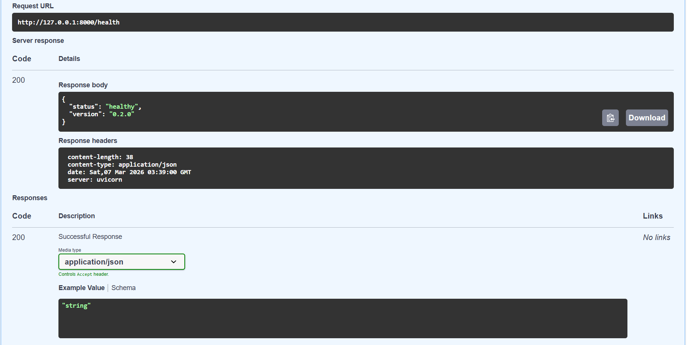
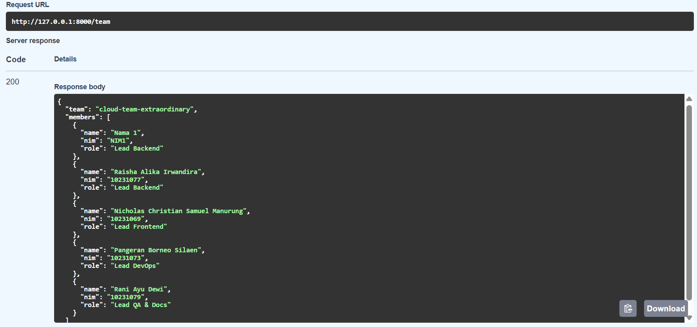
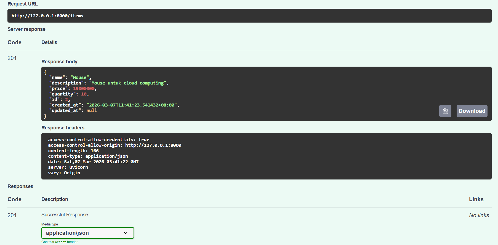
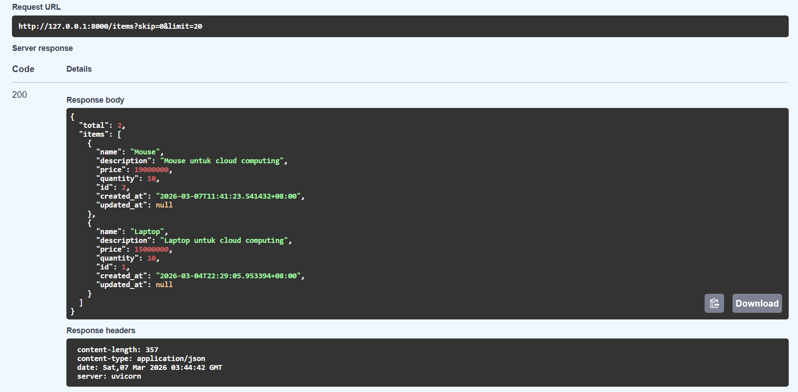
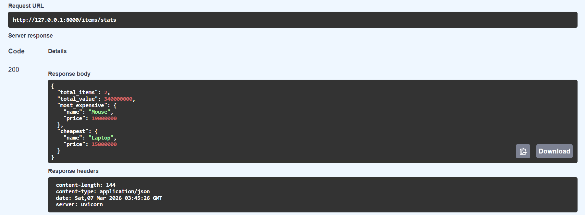
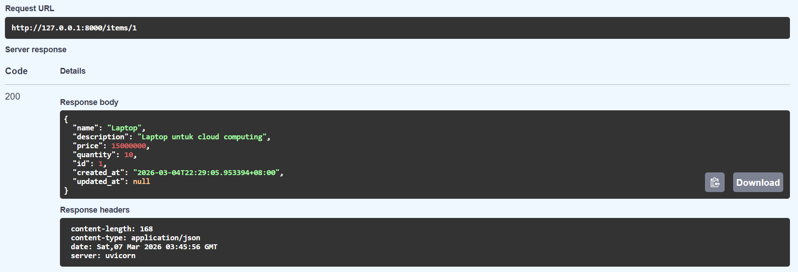
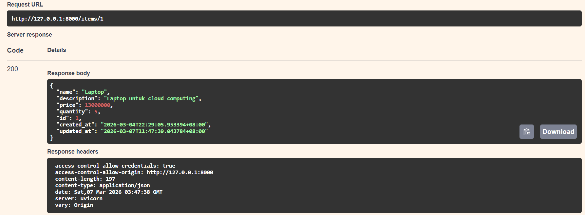
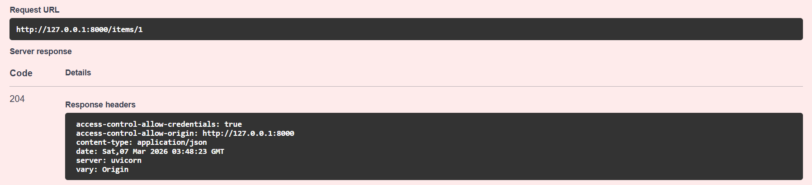

# API Test Results (Swagger)

Dokumen ini berisi hasil pengujian API menggunakan **Swagger UI** pada aplikasi yang berjalan di server lokal.

---

## 🔌 API Endpoints

Base URL: `http://localhost:8000`  
Dokumentasi interaktif: `http://localhost:8000/docs`

| Method | Endpoint | Deskripsi | Status Code |
|------|------|------|------|
| `GET` | `/health` | Health check API | 200 |
| `GET` | `/team` | Informasi anggota tim | 200 |
| `POST` | `/items` | Tambah item baru | 201 |
| `GET` | `/items` | List semua item (pagination + search) | 200 |
| `GET` | `/items/stats` | Statistik inventory | 200 |
| `GET` | `/items/{id}` | Ambil item berdasarkan ID | 200 / 404 |
| `PUT` | `/items/{id}` | Update item berdasarkan ID | 200 / 404 |
| `DELETE` | `/items/{id}` | Hapus item berdasarkan ID | 204 / 404 |

---

# 📸 Hasil Pengujian API

## 1️⃣ Health Check API

Endpoint untuk memastikan API berjalan dengan baik.

---

## 2️⃣ Get Team Information

Endpoint untuk menampilkan informasi anggota tim.

---

## 3️⃣ Create Item

Endpoint untuk menambahkan item baru ke dalam sistem.

---

## 4️⃣ Get All Items

Endpoint untuk mengambil seluruh daftar item dengan fitur pagination dan search.

---

## 5️⃣ Get Inventory Statistics

Endpoint untuk melihat statistik inventory.

---

## 6️⃣ Get Item by ID

Endpoint untuk mengambil data item berdasarkan ID tertentu.

---

## 7️⃣ Update Item by ID

Endpoint untuk memperbarui data item berdasarkan ID.

---

## 8️⃣ Delete Item by ID

Endpoint untuk menghapus item berdasarkan ID.

---