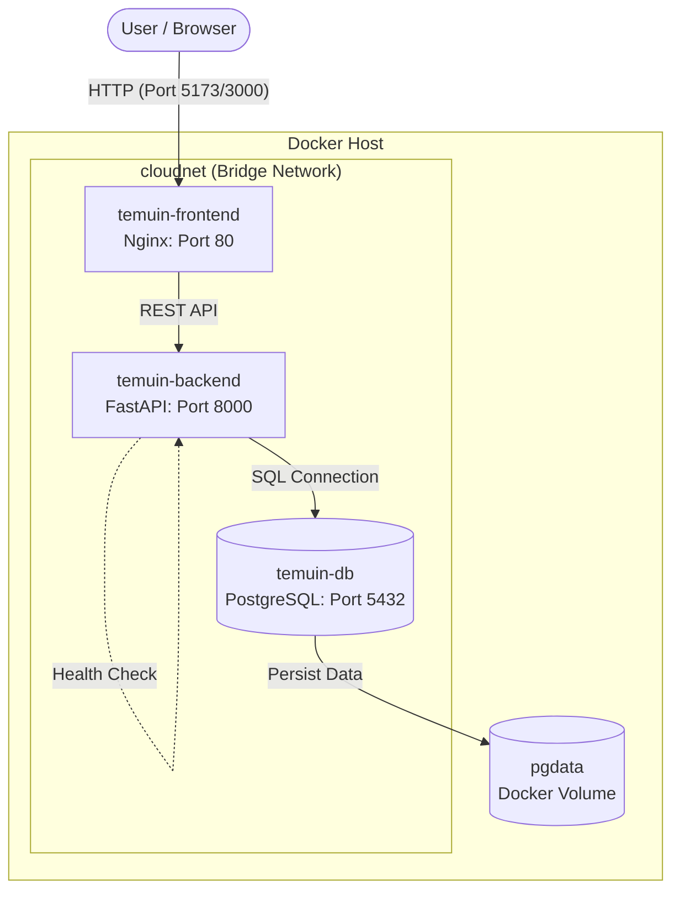

# Docker Architecture - Temuin (Modul 6)

Dokumen ini menjelaskan arsitektur containerization untuk aplikasi **Temuin** menggunakan Docker Compose. Arsitektur ini terdiri dari tiga container utama yang bekerja dalam satu network yang sama.

## 🏗️ Diagram Arsitektur

Berikut adalah gambaran interaksi antar container, port, dan volume dalam sistem:

## 📦 Detail Komponen

### 1. temuin-frontend
Container yang menyajikan antarmuka pengguna berbasis React yang telah di-build menjadi static files.

- **Base Image**: `nginx:alpine`
- **Internal Port**: `80`
- **External Port**: `5173` (atau sesuai konfigurasi host)
- **Environment Variables**:
  - `VITE_API_URL`: URL Endpoint Backend (misalnya `http://localhost:8000`)
- **Fungsi**: Melayani file HTML/JS/CSS dan meneruskan request API ke backend.

### 2. temuin-backend
Container yang menjalankan logika bisnis aplikasi menggunakan framework FastAPI.

- **Base Image**: `python:3.12-alpine` (Multi-stage build)
- **Internal Port**: `8000`
- **External Port**: `8000`
- **Environment Variables**:
  - `DATABASE_URL`: `postgresql+psycopg://user:pass@db:5432/dbname`
  - `SECRET_KEY`: Kunci untuk enkripsi JWT
  - `ALGORITHM`: Algoritma JWT (HS256)
- **Health Check**: `GET /health` (setiap 30 detik)

### 3. temuin-db
Container database PostgreSQL untuk menyimpan data laporan, user, dan status.

- **Base Image**: `postgres:16-alpine`
- **Internal Port**: `5432`
- **External Port**: `5432` (opsional untuk debug)
- **Environment Variables**:
  - `POSTGRES_USER`: Username database
  - `POSTGRES_PASSWORD`: Password database
  - `POSTGRES_DB`: Nama database
- **Volumes**:
  - `pgdata`: Mounted ke `/var/lib/postgresql/data` untuk persistensi data saat container dihapus.

## 🌐 Network & Security

Sistem menggunakan Docker Bridge Network bernama `cloudnet`.
- **Service Discovery**: Backend dapat menghubungi database menggunakan hostname `db`.
- **Isolation**: Database tidak perlu mengekspos port ke publik jika hanya diakses oleh backend.
- **Data Persistence**: Menggunakan Docker Volume bernama `pgdata` untuk memastikan data PostgreSQL tidak hilang saat container di-restart atau di-update.
