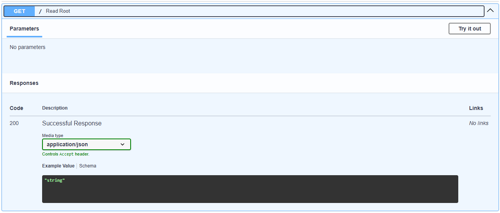
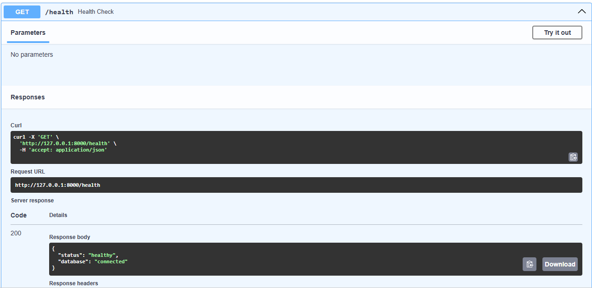
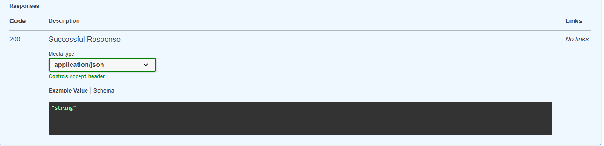
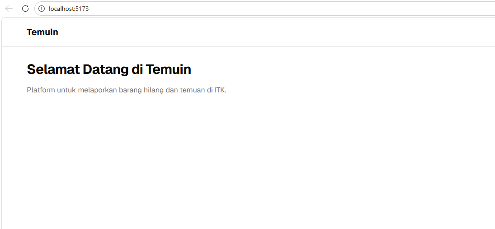

# Sprint 01 QA Report - Temuin

**Role**: Lead QA & Docs (@raniayudewi)
**Date**: 2026-04-08

## 1. QA-1.1 Review Dokumentasi

### Hasil Temuan
Dokumen aktif di `temuin-docs/` sudah direview. Struktur dokumen sudah sesuai dan tidak ditemukan gap yang signifikan antara AGENTS.md dan dokumen temuin-docs lainnya.

### Screenshot Bukti
Tidak diperlukan.

---

## 2. QA-1.2 Backend Setup Check

### Hasil Temuan
- Endpoint `GET /` merespons dengan `{"message": "Welcome to Temuin API"}` ✅
- Endpoint `GET /health` merespons dengan `{"status": "healthy", "database": "connected"}` ✅
- Swagger UI (`/docs`) dapat diakses dan menampilkan daftar endpoint ✅

### Screenshot Bukti

---

## 3. QA-1.3 Frontend Setup Check

### Hasil Temuan
- Frontend berhasil dijalankan dengan `npm run dev` di port 5173 ✅
- Halaman awal berhasil dimuat di browser tanpa error ✅
- Layout shell dan struktur dasar halaman tampil dengan benar ✅
- Tidak ada white screen atau crash saat dibuka di browser ✅
- Styling Tailwind CSS dan komponen dasar sudah terpasang ✅

> **Catatan bug yang ditemukan dan diperbaiki:**
> 1. Error `ModuleNotFoundError: No module named 'psycopg2'` — diselesaikan dengan menjalankan backend menggunakan `venv` yang benar.
> 2. Error `Can't resolve 'shadcn/tailwind.css'` — diselesaikan dengan menghapus import yang tidak valid di `src/index.css`.

### Screenshot Bukti

---

## 4. Status Task Sprint 01 (QA)

| Task ID | Nama Task | Status | Hasil | Bukti (Image Path) |
|---------|-----------|--------|-------|-------------------|
| QA-1.1  | Review Dokumentasi | done | Dokumen aktif direview, tidak ada gap signifikan | - |
| QA-1.2  | Backend Setup Check | done | Health check `/health` connected & root working | [health-1](../image/sprint-01/backend-health-1.png), [health-2](../image/sprint-01/backend-health-2.png), [root](../image/sprint-01/backend-root.png) |
| QA-1.3  | Frontend Setup Check | done | Halaman tampil tanpa error, layout shell muncul, 2 bug setup berhasil diperbaiki | [frontend-home](../image/sprint-01/frontend-home.png) |
| QA-1.4  | Screenshots & Health | done | Screenshot backend dan frontend tersimpan di `image/sprint-01/` | [frontend-home](../image/sprint-01/frontend-home.png), [backend-health](../image/sprint-01/backend-health-1.png) |

---

## 5. Catatan Tambahan

*(Opsional: Kendala atau hal yang perlu diperhatikan tim lain)*
