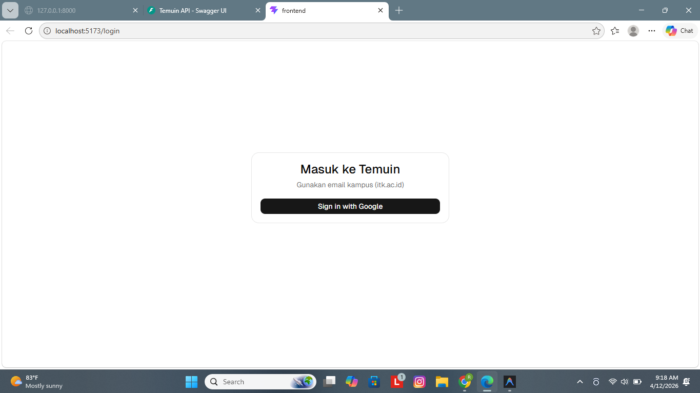
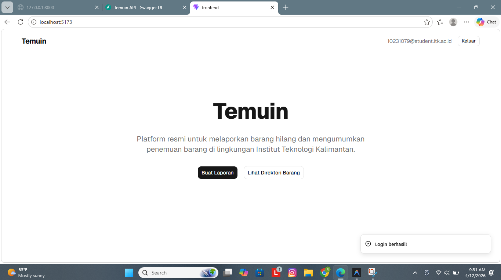
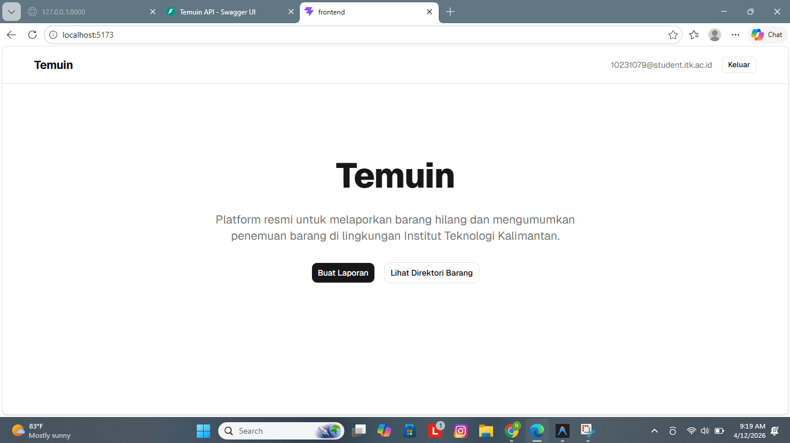
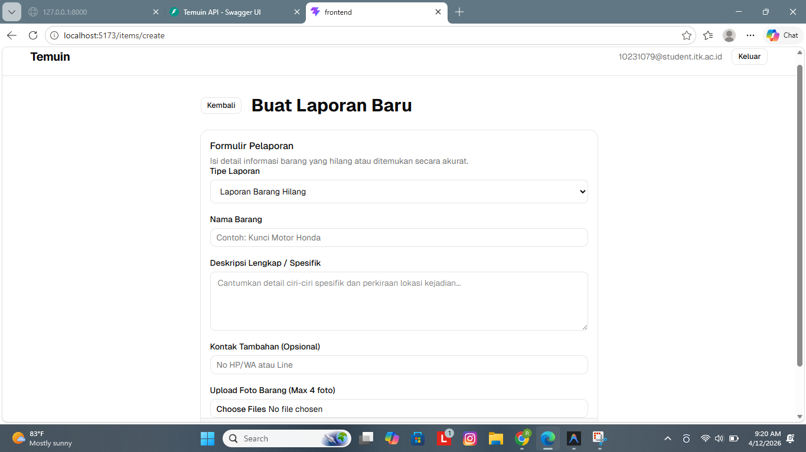
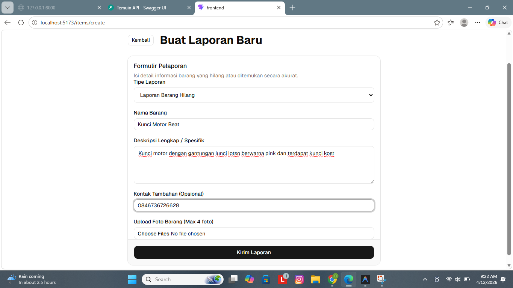
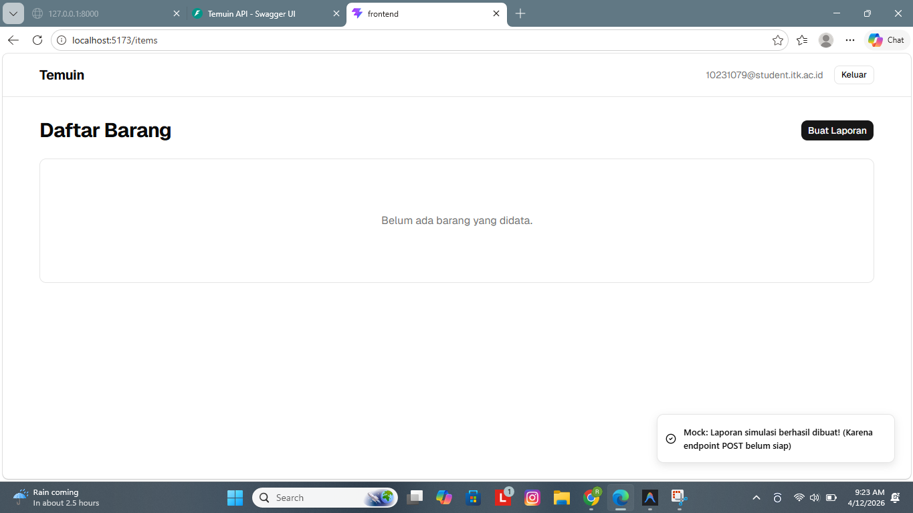
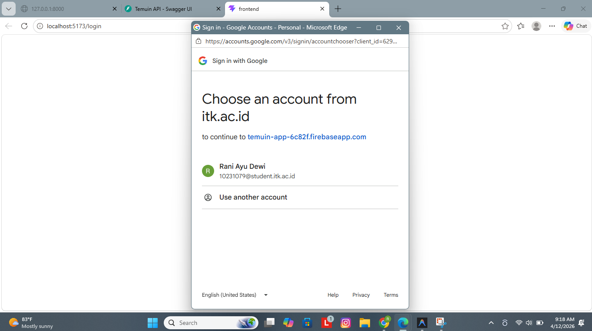

# Sprint 02 QA Report - Temuin

**Role**: Lead QA & Docs (@raniayudewi)
**Date**: 2026-04-12

## 1. QA-2.1 Blackbox Login Flow
### Hasil Temuan
- Fitur login dengan Google berhasil diintegrasikan.
- Validasi email kampus (`@itk.ac.id`) berjalan dengan benar di sisi backend dan frontend.
- User baru otomatis tersinkronisasi ke database internal setelah login pertama kali. ✅

### Screenshot Bukti

---

## 2. QA-2.2 & QA-2.3 Item Flow (List & Detail)
### Hasil Temuan
- Halaman list barang (Item List) sudah dapat menampilkan data dari API.
- Detail item sudah dapat diakses dengan informasi yang sesuai.
- **Catatan Penting**: Fitur "Buat Laporan" (Create Item) di frontend saat ini masih berupa simulasi/mockup. UI Flow sudah lengkap (pilih jenis, isi form, sukses), namun data belum benar-benar tersimpan ke database karena integrasi final API create sedang dikerjakan oleh tim frontend. ✅

### Screenshot Bukti

---

## 3. Hasil Pengujian Backend (Swagger)
### Hasil Temuan
- Endpoint `POST /auth/login` berhasil divalidasi menggunakan token id dari Google.
- Endpoint `GET /auth/me` berhasil mengembalikan data user yang sah menggunakan Bearer Token (JWT).
- Endpoint `GET /items` mengembalikan daftar barang secara publik. ✅

---

## 4. Status Task Sprint 02 (QA)

| Task ID | Nama Task | Status | Hasil | Bukti (Image Path) |
|---------|-----------|--------|-------|-------------------|
| QA-2.1  | Blackbox login flow | done | Login & Sync success | [login-success](../image/sprint-02/02-login-success.png) |
| QA-2.2  | Blackbox item flow | done | List & Detail OK, Create UI Mockup OK | [item-list](../image/sprint-02/07-item-list.png) |
| QA-2.3  | Simpan Screenshot | done | 7 screenshot tersimpan di `image/sprint-02/` | - |
| QA-2.4  | Update Dokumen | done | README & Sprint Report diupdate | - |

---

## 5. Catatan Tambahan
Pengecekan backend manual melalui Swagger harus menggunakan JWT token yang didapat dari tab Network browser, karena tombol "Authorize" standar sedang konflik dengan enkripsi Firebase. Tim QA menyarankan penggunaan Postman untuk pengujian API yang lebih mendalam.
