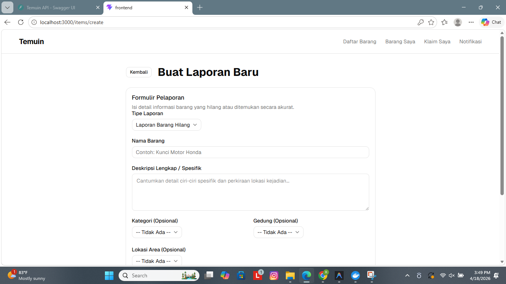
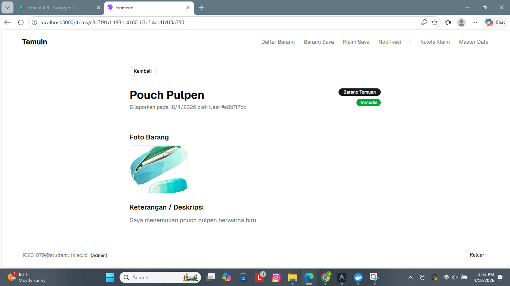
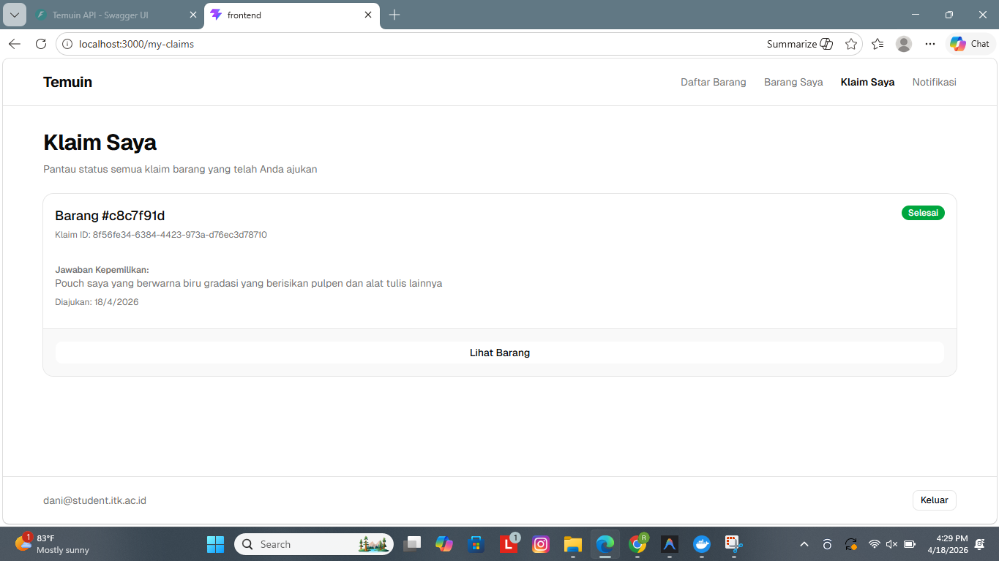

# Sprint 02 QA Report - Temuin

**Role**: Lead QA & Docs (@raniayudewi)
**Date**: 2026-04-18

## 1. QA-2.1 [Blackbox Login & Register Flow]

**Deskripsi Tugas:**
> Melakukan blackbox testing pada alur login dan registrasi, termasuk validasi bahwa sistem hanya menerima email kampus `@itk.ac.id` (Ref: BE-2.2, FE-2.1).

### Hasil Temuan
- Fitur Register berhasil memvalidasi format email dan syarat password.
- Login dengan Google dan email kampus (@itk.ac.id) berjalan dengan benar.
- Penanganan error pada login (email/password salah) sudah sesuai.
- Role management (Admin/User) berhasil memisahkan dashboard setelah login.

| Kondisi | Status | Bukti |
|---------|--------|-------|
| Register dengan email non-ITK ditolak | ✅ | [lihat](../image/sprint-02/06-register-itk-only.png) |
| Register dengan password < 8 karakter ditolak | ✅ | [lihat](../image/sprint-02/07-register-password-length.png) |
| Register dengan email yang sudah terdaftar ditolak | ✅ | [lihat](../image/sprint-02/09-register-already-exists.png) |
| Login Admin masuk ke Dashboard Admin | ✅ | [lihat](../image/sprint-02/01-admin-login-success.png) |
| Login User masuk ke Dashboard User | ✅ | [lihat](../image/sprint-02/03-user-login-success.png) |
| Login dengan data salah menampilkan error | ✅ | [lihat](../image/sprint-02/04-login-error-email.png) |

### Screenshot Bukti

---

## 2. QA-2.2 [Blackbox Item Flow - Create, List, Detail]

**Deskripsi Tugas:**
> Melakukan blackbox testing pada alur pembuatan laporan barang (Lost/Found), serta memastikan daftar barang dan detail barang menampilkan data yang akurat (Ref: BE-2.4, FE-2.3, FE-2.4).

### Hasil Temuan
- Flow pembuatan laporan barang (Lost & Found) berjalan lancar baik untuk Admin maupun User.
- Daftar barang menampilkan data secara real-time setelah diinput.
- Detail barang menampilkan informasi lengkap termasuk foto dan deskripsi.

| Fitur | Status | Bukti |
|-------|--------|-------|
| User buat laporan barang temuan | ✅ | [lihat](../image/sprint-02/10-user-create-item.png) |
| Admin buat laporan barang hilang | ✅ | [lihat](../image/sprint-02/11-admin-create-item.png) |
| Admin melihat daftar "Barang Saya" | ✅ | [lihat](../image/sprint-02/16-my-items-admin.png) |
| User melihat daftar "Barang Saya" | ✅ | [lihat](../image/sprint-02/17-my-items-user.png) |
| Halaman item list menampilkan semua barang | ✅ | [lihat](../image/sprint-02/15-item-list-user.png) |
| Detail item menampilkan info yang sesuai | ✅ | [lihat](../image/sprint-02/21-item-detail-found.png) |

### Screenshot Bukti

---

## 3. QA-2.5 [Blackbox Claim Flow - Submit to Completion]

**Deskripsi Tugas:**
> (Tambahan) Melakukan verifikasi alur klaim barang temuan (Claim) dari sisi user (submission) hingga sisi admin (approval & completion) (Ref: PRD User Flow 4).

### Hasil Temuan
- Alur pengajuan klaim (claim) dari user ke admin sudah berfungsi penuh.
- Admin dapat menyetujui, menolak, atau menyelesaikan klaim.
- Notifikasi status klaim muncul di sisi user.

| Tahapan Flow | Status | Bukti |
|--------------|--------|-------|
| User ajukan klaim pada barang temuan | ✅ | [lihat](../image/sprint-02/23-user-submit-claim.png) |
| User dapat notifikasi klaim berhasil diajukan | ✅ | [lihat](../image/sprint-02/24-claim-notif-success.png) |
| Admin melihat daftar pengajuan klaim | ✅ | [lihat](../image/sprint-02/22-admin-claim-list.png) |
| Admin menyetujui klaim user | ✅ | [lihat](../image/sprint-02/27-admin-approve-claim.png) |
| Admin menolak klaim user | ✅ | [lihat](../image/sprint-02/28-admin-reject-claim.png) |
| Admin memproses serah terima (Complete) | ✅ | [lihat](../image/sprint-02/29-admin-complete-claim.png) |
| Status klaim berubah menjadi Completed di sisi user | ✅ | [lihat](../image/sprint-02/30-user-claim-completed.png) |

### Screenshot Bukti

---

## 4. Status Task Sprint 02 (QA)

| Task ID | Nama Task | Status | Hasil | Bukti (Image Path) |
|---------|-----------|--------|-------|---------------------|
| QA-2.1  | Blackbox login & register | done | Auth flow secure | [success](../image/sprint-02/01-admin-login-success.png), [register](../image/sprint-02/08-register-page.png) |
| QA-2.2  | Blackbox item flow | done | Create, List, Detail OK | [create](../image/sprint-02/14-item-created-success.png), [detail](../image/sprint-02/21-item-detail-found.png) |
| QA-2.3  | Simpan Screenshot | done | 30 images archived | [folder](../image/sprint-02/) |
| QA-2.4  | Update Laporan QA | done | Report updated | [this file](./sprint-02-qa-report.md) |
| -       | **Claim Flow (Additional)** | done | Full flow verified | [claim](../image/sprint-02/23-user-submit-claim.png), [finish](../image/sprint-02/30-user-claim-completed.png) |

---

