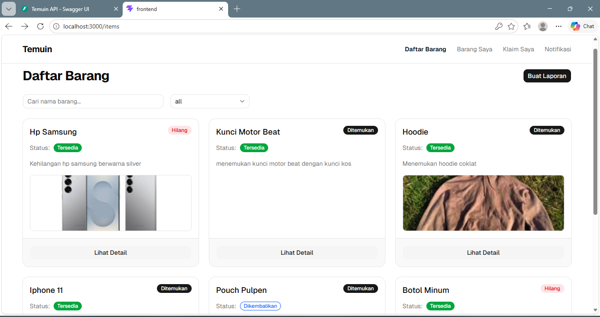
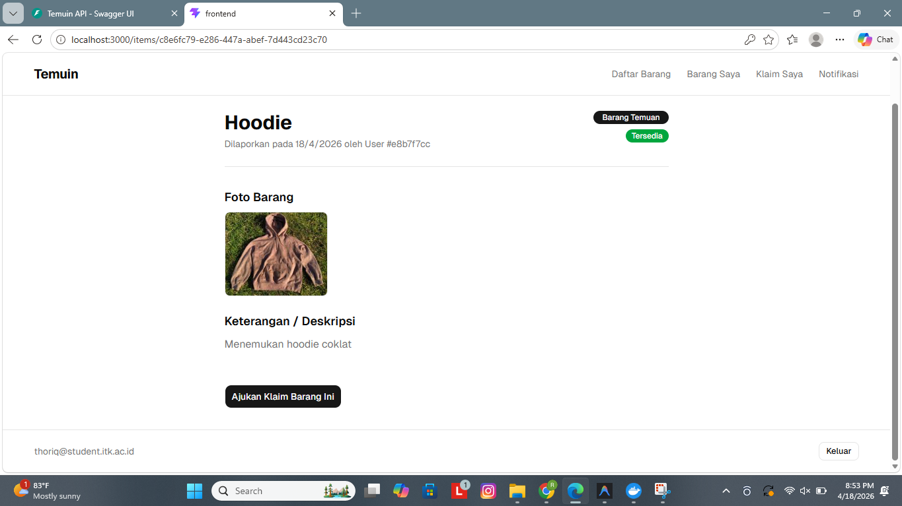
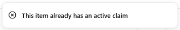
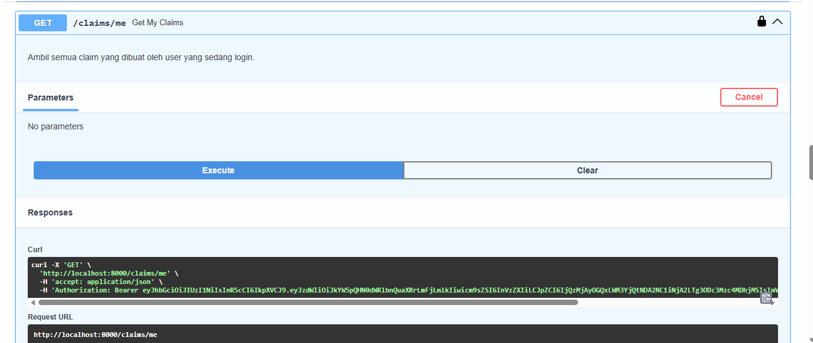
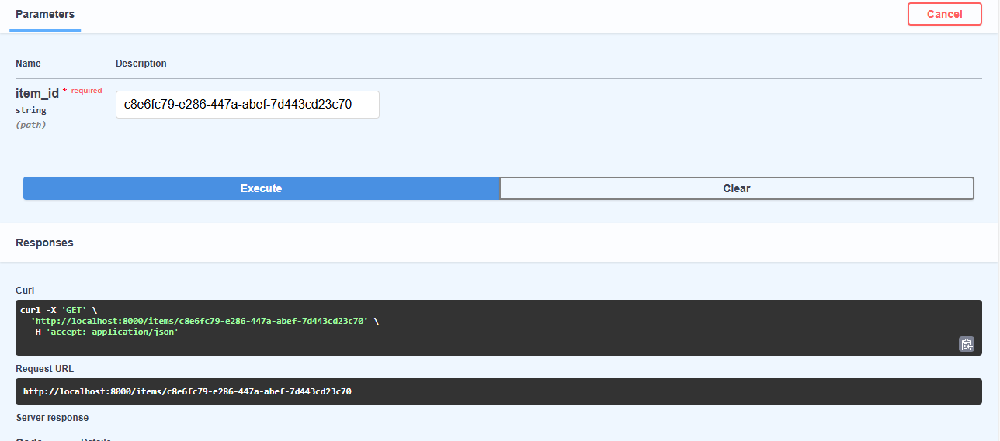
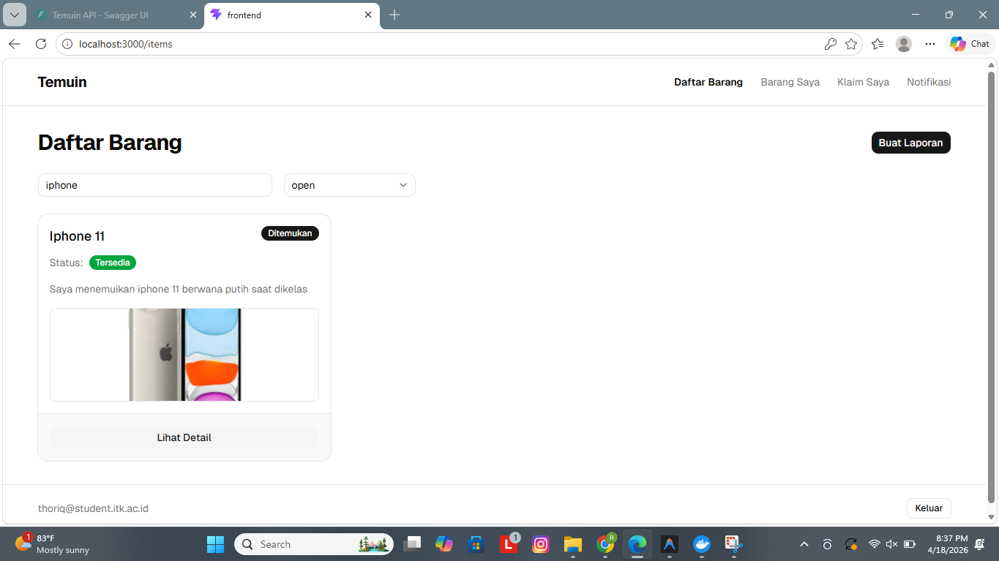
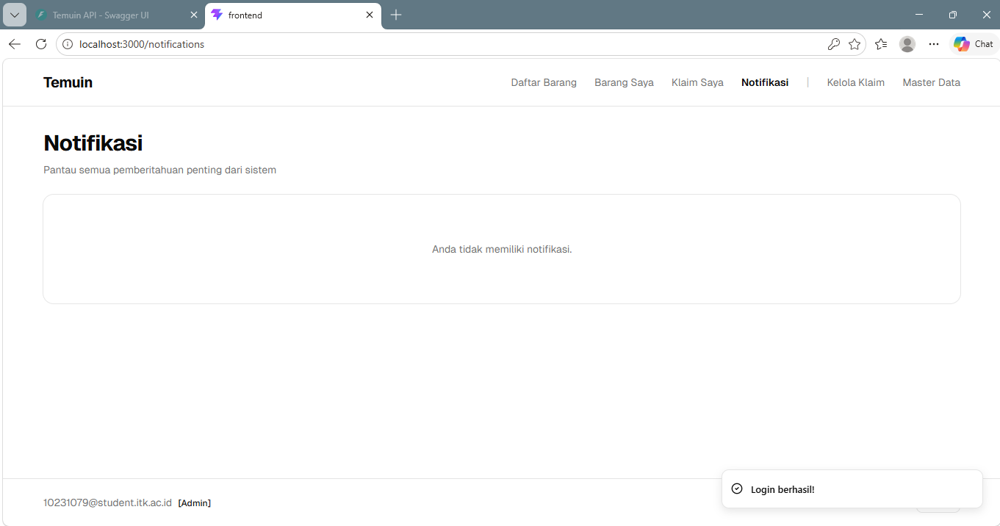
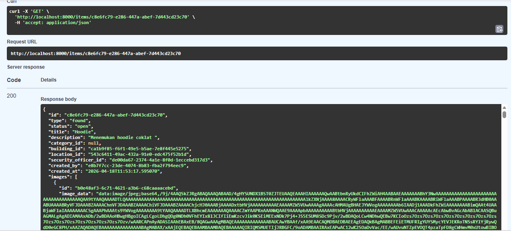

# Sprint 03 QA Report - Temuin

**Role**: Lead QA & Docs (@raniayudewi)
**Date**: 2026-04-18

## 1. QA-3.1 [Blackbox Claim Submission & Status API]

**Deskripsi Tugas:**
> Melakukan blackbox testing pada alur pengajuan klaim (claim submission) dari sisi user dan memverifikasi perubahan status item melalui API (Ref: BE-3.1, BE-3.2, FE-3.2).

### Hasil Temuan
- Fitur pengajuan klaim melalui UI berjalan lancar.
- Verifikasi melalui Swagger menunjukkan klaim berhasil dibuat dengan status `pending` dan jawaban kepemilikan tersimpan.
- **TEMUAN UNIK**: Meskipun di Swagger status item masih `open`, pada UI (Frontend) sudah muncul notifikasi/indikator bahwa barang tersebut sedang diklaim orang lain. Hal ini menunjukkan adanya inkonsistensi antara logika Frontend dan Backend.
- **BUG FOUND**: Status item di database tidak berubah menjadi `in_claim` setelah klaim diajukan (tetap `open`).

| Kondisi | Status | Bukti |
|---------|--------|-------|
| User submit form klaim | ✅ | [lihat](../image/sprint-03/05-claim-item-detail.png) |
| Klaim muncul di `/claims/me` sebagai `pending` | ✅ | [lihat](../image/sprint-03/10-swagger-claim-me-new.png) |
| Sinkronisasi status item ke `in_claim` | ❌ | [lihat](../image/sprint-03/11-swagger-item-status-bug.png) |

### Screenshot Bukti

---

## 2. QA-3.2 [Blackbox Search, Filter, & Badge Status]

**Deskripsi Tugas:**
> Menguji fitur pencarian barang, filter kategori/lokasi, dan tampilan badge status pada daftar item (Ref: BE-3.3, FE-3.1, FE-3.4).

### Hasil Temuan
- Fitur pencarian berdasarkan teks (keyword) berhasil menyaring daftar barang.
- Dropdown filter lokasi dan tipe barang berfungsi dengan benar.
- Badge status (Open/In Claim) tampil pada kartu item di UI.

| Fitur | Status | Bukti |
|-------|--------|-------|
| Pencarian keyword teks | ✅ | [lihat](../image/sprint-03/07-search-filter-test.png) |
| Filter dropdown (Gedung/Lokasi) | ✅ | [lihat](../image/sprint-03/07-search-filter-test.png) |
| Tampilan daftar barang untuk diklaim | ✅ | [lihat](../image/sprint-03/04-claim-target-list.png) |

### Screenshot Bukti

---

## 3. QA-3.3 [Blackbox Notifications & Master Data]

**Deskripsi Tugas:**
> Verifikasi alur notifikasi in-app dan ketersediaan master data (lokasi, satpam) pada form (Ref: BE-3.4, FE-3.3).

### Hasil Temuan
- Master data (Daftar Gedung & Satpam) muncul dengan lengkap pada dropdown form.
- **BUG FOUND**: Halaman/Page Notifikasi (`/notifications`) baik untuk User maupun Admin masih **kosong/blank** dan tidak menampilkan daftar notifikasi, padahal notifikasi instan (pop-up) muncul saat ada klaim baru diajukan.
- Notifikasi instan masuk ke akun user setelah berhasil mengajukan klaim.
- Notifikasi instan admin juga muncul saat ada pengajuan klaim baru.

| Fitur | Status | Bukti |
|-------|--------|-------|
| Daftar Gedung pada dropdown | ✅ | [lihat](../image/sprint-03/01-master-data-building.png) |
| Daftar Satpam pada dropdown | ✅ | [lihat](../image/sprint-03/02-master-data-security.png) |
| Notifikasi pop-up muncul di UI | ✅ | [lihat](../image/sprint-03/06-claim-success-notif.png) |
| Halaman Notifikasi (List Page) | ❌ | [lihat](../image/sprint-03/03-user-notifications.png) |

### Screenshot Bukti

---

## 4. QA-3.5 [Blackbox Laporan Baru & Image Upload]

**Deskripsi Tugas:**
> Menguji alur pembuatan laporan barang baru (Lost/Found) dan fungsionalitas upload gambar (Ref: FE-2.3, FE-3.4).

### Hasil Temuan
- Pembuatan laporan baru berhasil menyimpan data ke backend.
- Upload gambar berhasil; data gambar tersimpan dalam format Base64 di database (kolom `image_data`).

| Fitur | Status | Bukti |
|-------|--------|-------|
| Submit laporan baru | ✅ | [lihat](../image/sprint-03/12-swagger-item-detail-full.png) |
| Verifikasi image_data (Base64) di API | ✅ | [lihat](../image/sprint-03/12-swagger-item-detail-full.png) |

### Screenshot Bukti

---

## 5. Status Task Sprint 03 (QA)

| Task ID | Nama Task | Status | Hasil | Bukti (Image Path) |
|---------|-----------|--------|-------|---------------------|
| QA-3.1  | Claim Submission UI & API | done | Bug found in sync | [link](../image/sprint-03/10-swagger-claim-me-new.png) |
| QA-3.2  | Search, Filter & Badges | done | All filters OK | [link](../image/sprint-03/07-search-filter-test.png) |
| QA-3.3  | Notifications & Master Data| done | Data entries complete | [link](../image/sprint-03/03-user-notifications.png) |
| QA-3.4  | Screenshot Evidence | done | 12 images archived | [folder](../image/sprint-03/) |
| QA-3.5  | New Item & Image Upload | done | Base64 storage OK | [link](../image/sprint-03/12-swagger-item-detail-full.png) |

---

## 6. Catatan Tambahan (Bug Log)

> **BUG 1 [High Priority]**: Item status sinkronisasi Backend.
> **Deskripsi**: Saat user mengajukan klaim, status item di API tetap `open`, padahal seharusnya `in_claim`. (Uniknya, Frontend sudah punya indikator "sedang diklaim" sendiri).
> **Dampak**: Inkonsistensi data antara UI dan API yang bisa membingungkan sistem jika ada filter berbasis status.
> **Referensi Gambar**: [Status Bug](../image/sprint-03/11-swagger-item-status-bug.png)

---

> **BUG 2 [Medium Priority]**: Halaman Notifikasi Kosong.
> **Deskripsi**: Meskipun notifikasi instan (pop-up) berhasil muncul, halaman khusus `/notifications` tidak menampilkan daftar riwayat notifikasi (kosong).
> **Dampak**: User tidak bisa melihat riwayat notifikasi yang sudah lewat.
> **Referensi Gambar**: [Page Notif Kosong](../image/sprint-03/03-user-notifications.png)
