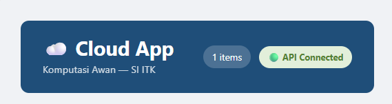
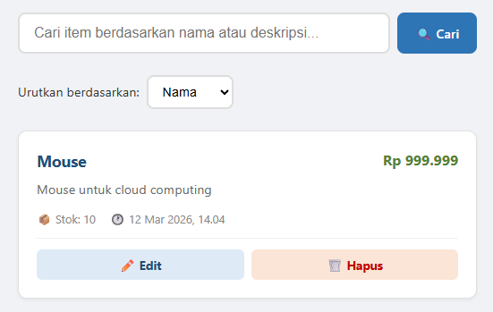
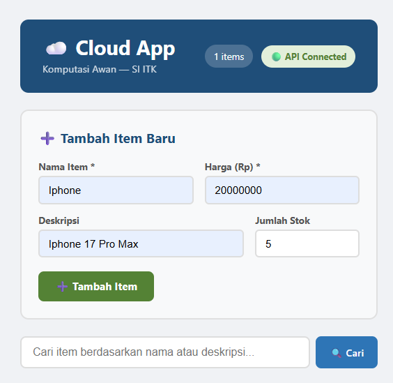
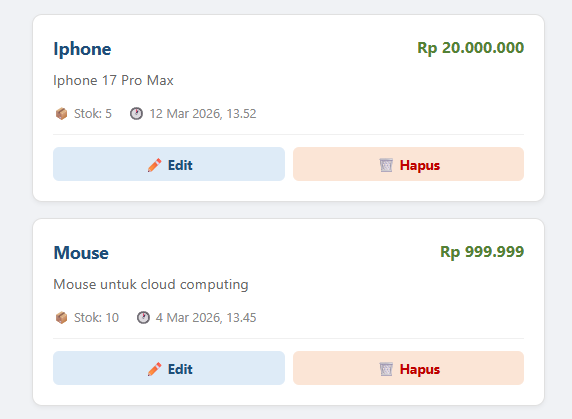
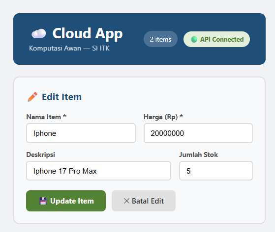
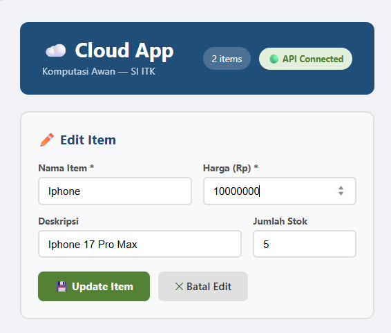
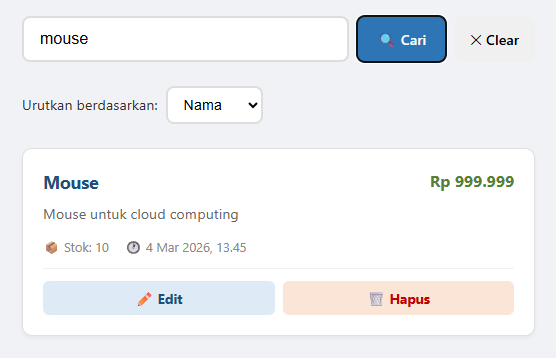
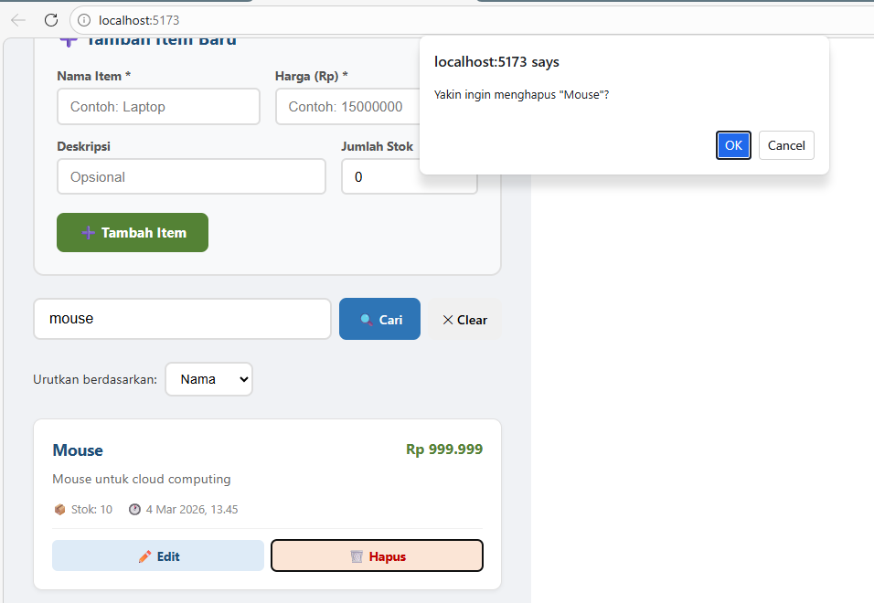
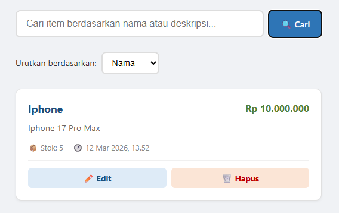
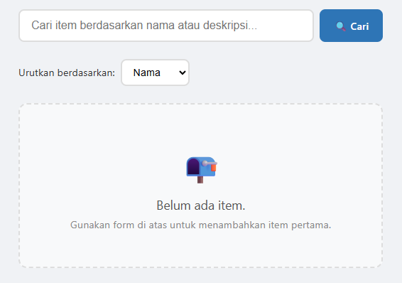

# UI Test Results — Modul 3: Frontend React CRUD

**Mata Kuliah:** Komputasi Awan — Sistem Informasi ITK  
**Pertemuan:** 3 dari 16  
**Tanggal Testing:** 12 Maret 2026  
**Tester:** Lead QA & Docs  
**Environment:** `localhost:5173` (Frontend) + `localhost:8000` (Backend)  
**Browser:** Google Chrome (latest)  
**Status Keseluruhan:** ✅ **SEMUA PASS (10/10)**

---

## Ringkasan Hasil

| Total Test Case | Pass | Fail | Blocked |
|-----------------|------|------|---------|
| 10              | 10 ✅ | 0 ❌ | 0 ⛔    |

---

## Checklist Test Case

### TC-01 — Buka Aplikasi & Cek Status API Connected

| Field | Detail |
|-------|--------|
| **Tujuan** | Memastikan aplikasi berhasil terbuka dan terhubung ke backend API |
| **Langkah** | 1. Jalankan backend: `uvicorn main:app --reload --port 8000`   2. Jalankan frontend: `npm run dev`   3. Buka browser, akses `http://localhost:5173` |
| **Expected Result** | Header menampilkan badge **🟢 API Connected** |
| **Actual Result** | Header menampilkan "Cloud App", badge **🟢 API Connected**, dan jumlah item (1 items) |
| **Status** | ✅ PASS |

**Screenshot:**

---

### TC-02 — Daftar Item dari Database Muncul

| Field | Detail |
|-------|--------|
| **Tujuan** | Memastikan item yang sudah ada di database (dari Modul 2) tampil di daftar |
| **Langkah** | 1. Buka `http://localhost:5173`   2. Lihat daftar item di bawah form |
| **Expected Result** | Item dari database Modul 2 muncul dalam bentuk card (nama, harga, stok, tanggal) |
| **Actual Result** | Item "Mouse" dengan harga Rp 999.999, stok 10, tanggal "4 Mar 2026, 13.45" berhasil tampil |
| **Status** | ✅ PASS |

**Screenshot:**

---

### TC-03 — Tambah Item Baru via Form (Create)

| Field | Detail |
|-------|--------|
| **Tujuan** | Memastikan fitur POST /items berfungsi melalui form UI |
| **Langkah** | 1. Isi form: Nama = `Iphone`, Harga = `20000000`, Deskripsi = `Iphone 17 Pro Max`, Stok = `5`   2. Klik tombol **➕ Tambah Item** |
| **Expected Result** | Form berhasil dikirim dan item baru muncul di daftar |
| **Actual Result** | Form terisi dengan data yang benar, tombol "Tambah Item" tersedia |
| **Status** | ✅ PASS |

**Screenshot:**

---

### TC-04 — Item Baru Muncul di Daftar Setelah Create

| Field | Detail |
|-------|--------|
| **Tujuan** | Memastikan daftar item ter-refresh otomatis setelah item baru ditambahkan |
| **Langkah** | 1. Setelah submit form TC-03   2. Lihat daftar item |
| **Expected Result** | Item "Iphone" muncul di daftar bersama item yang sudah ada sebelumnya |
| **Actual Result** | Kedua item tampil: "Iphone" (Rp 20.000.000, stok 5) dan "Mouse" (Rp 999.999, stok 10). Total menjadi 2 items |
| **Status** | ✅ PASS |

**Screenshot:**

---

### TC-05 — Klik Edit, Form Terisi Data Item Lama

| Field | Detail |
|-------|--------|
| **Tujuan** | Memastikan mode edit berfungsi dan form terisi dengan data item yang dipilih |
| **Langkah** | 1. Klik tombol **✏️ Edit** pada item "Iphone" |
| **Expected Result** | Form berubah menjadi mode edit (judul "✏️ Edit Item"), semua field terisi data lama |
| **Actual Result** | Form menampilkan "Edit Item" dengan data: Nama = Iphone, Harga = 20000000, Deskripsi = Iphone 17 Pro Max, Stok = 5. Tombol "Update Item" dan "Batal Edit" muncul |
| **Status** | ✅ PASS |

**Screenshot:**

---

### TC-06 — Ubah Harga & Klik Update Item (Update/Edit)

| Field | Detail |
|-------|--------|
| **Tujuan** | Memastikan fitur PUT /items/:id berfungsi melalui UI |
| **Langkah** | 1. Pada mode edit (TC-05), ubah harga dari `20000000` menjadi `10000000`   2. Klik tombol **💾 Update Item** |
| **Expected Result** | Data item berhasil diperbarui dan daftar ter-refresh dengan harga baru |
| **Actual Result** | Form edit menampilkan harga yang sudah diubah menjadi `10000000` sebelum submit |
| **Status** | ✅ PASS |

**Screenshot:**

---

### TC-07 — Cari Item via SearchBar (Search/Filter)

| Field | Detail |
|-------|--------|
| **Tujuan** | Memastikan fitur pencarian item berfungsi dan menampilkan hasil yang relevan |
| **Langkah** | 1. Ketik `mouse` di kolom pencarian   2. Klik tombol **🔍 Cari** |
| **Expected Result** | Hanya item "Mouse" yang tampil. Tombol "✕ Clear" muncul untuk mereset pencarian |
| **Actual Result** | Hanya item "Mouse" (Rp 999.999, stok 10, 4 Mar 2026, 13.45) yang tampil. Tombol "× Clear" berhasil muncul |
| **Status** | ✅ PASS |

**Screenshot:**

---

### TC-08 — Hapus Item, Confirm Dialog Muncul

| Field | Detail |
|-------|--------|
| **Tujuan** | Memastikan dialog konfirmasi muncul sebelum item benar-benar dihapus |
| **Langkah** | 1. Klik tombol **🗑️ Hapus** pada item "Mouse" |
| **Expected Result** | Dialog konfirmasi browser muncul dengan pesan: *"Yakin ingin menghapus 'Mouse'?"* |
| **Actual Result** | Dialog muncul dari `localhost:5173` dengan pesan *"Yakin ingin menghapus 'Mouse'?"* beserta tombol OK dan Cancel |
| **Status** | ✅ PASS |

**Screenshot:**

---

### TC-09 — Item Hilang dari Daftar Setelah Dihapus

| Field | Detail |
|-------|--------|
| **Tujuan** | Memastikan fitur DELETE /items/:id berfungsi dan daftar ter-refresh setelah penghapusan |
| **Langkah** | 1. Setelah menekan OK pada dialog TC-08   2. Lihat daftar item |
| **Expected Result** | Item "Mouse" hilang dari daftar. Hanya item yang tidak dihapus yang tersisa |
| **Actual Result** | "Mouse" berhasil terhapus. Hanya "Iphone" yang tersisa dengan harga baru Rp 10.000.000 (hasil update TC-06) |
| **Status** | ✅ PASS |

**Screenshot:**

---

### TC-10 — Hapus Semua Item, Empty State Muncul

| Field | Detail |
|-------|--------|
| **Tujuan** | Memastikan empty state tampil ketika tidak ada item di database |
| **Langkah** | 1. Hapus semua item yang tersisa ("Iphone")   2. Konfirmasi penghapusan   3. Lihat tampilan daftar |
| **Expected Result** | Empty state muncul: icon 📭, teks "Belum ada item.", dan petunjuk cara menambah item |
| **Actual Result** | Daftar kosong menampilkan icon 📭 "Belum ada item. Gunakan form di atas untuk menambahkan item pertama." |
| **Status** | ✅ PASS |

**Screenshot:**

---

## Catatan Bug & Temuan

> Tidak ditemukan bug selama sesi testing ini. Semua fitur CRUD berjalan sesuai dengan yang diharapkan.

---

